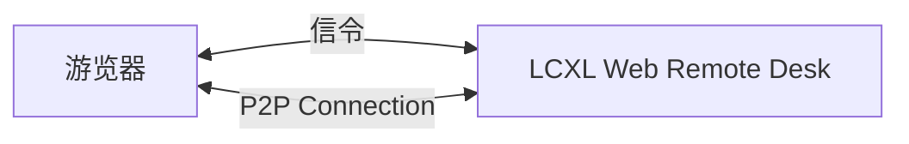

# LCXL Web Remote Desk——基于 Web 的远程桌面

LCXL Web Remote Desk 是一个基于 Web 技术的远程桌面解决方案，允许用户只通过浏览器访问和控制远程计算机。这个项目使用 WebRTC 技术来实现高效的视频流传输，后端使用 Rust 语言开发，前端则采用 React 框架。

## 网络架构图

LCXL Web Remote Desk 的网络架构图如下：

上面除了游览器以外有4个组件：
1. **信令服务器 (Signaling Server)**: 用于协调浏览器和远程桌面之间的连接，帮助建立 WebRTC 连接。
2. **STUN 服务器**: 用于获取网络地址信息，帮助解决 NAT 遍历问题。
3. **TURN 服务器**: 当 P2P 连接无法直接建立时，TURN 服务器作为中继服务器来传输数据。
4. **LCXL Web Remote Desk (desk)**: 远程桌面的后端服务，使用 Rust 开发。

上面4个组件其实都集成在 LCXL Web Remote Desk 中。可以根据实际需求进行配置和扩展。

在远程桌面有公网IP或者在同一个局域网的情况下，浏览器可以直接与远程桌面建立 P2P 连接，不需要 TURN 服务器。在这种情况下，网络架构图如下：

