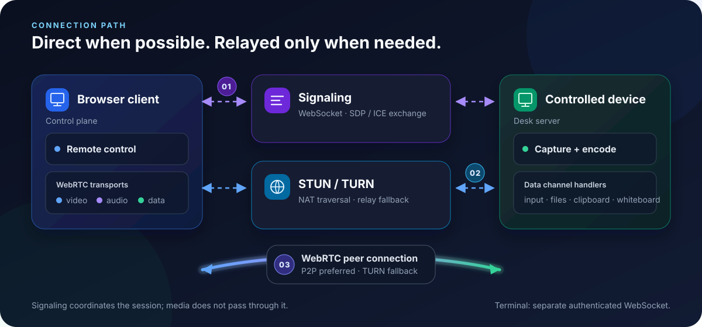
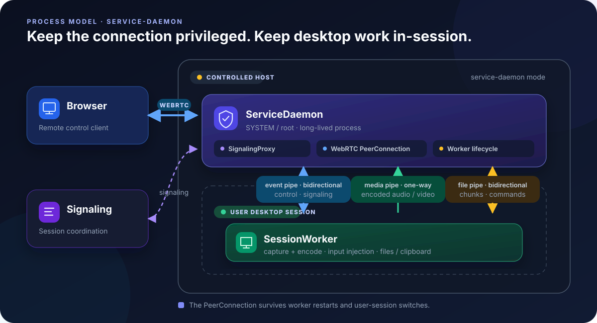
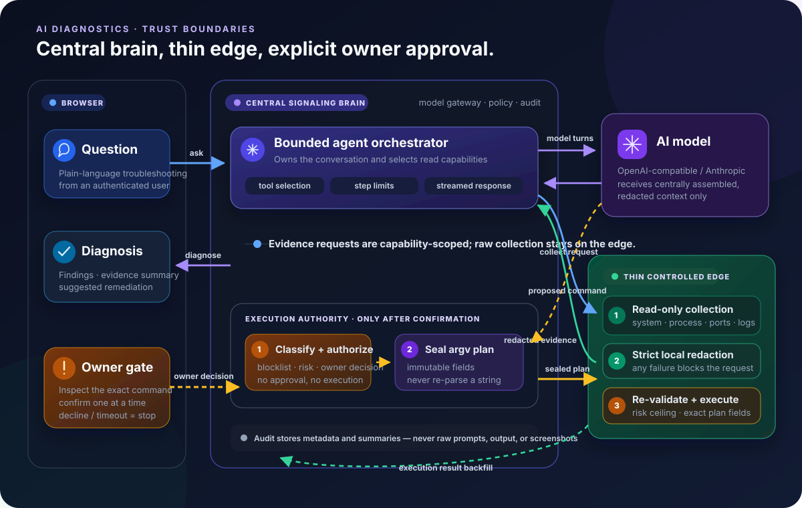

# LCXL Remote Desk Web

[中文](README_CN.md)

> [!WARNING]
>
> **Disclaimer**: This project is in an early stage of development. The codebase may be unstable, contain unfixed issues, or have incomplete features.
>
> **Security Warning**: This project must not be used for any unlawful purpose. The author(s) accept no liability for any damage arising from its use.

LCXL Remote Desk Web is an **AI-native**, open-source high-performance remote desktop.

* Built natively on WebRTC — there is no separate control client to install; any modern browser gives you a native remote-desktop experience.
* The host runs natively on Windows, macOS, and Linux, with 4K @ 60 Hz screen capture and output.
* AI is a first-class control plane: ask in plain language and let the agent diagnose the problem and help fix it.
* Rust backend; React, Vite, and Tailwind CSS frontend.

---

## Key Features

- **Capability-Scoped Access**: Device codes can carry per-capability ceilings for remote control, file browsing/transfer/delete, terminal, clipboard, privacy screen, and whiteboard. Host policy and live approval still apply.
- **High-Performance Streaming**: WebRTC video with X264 / OpenH264 / VP8 / VP9 / AV1 software encoders, plus Opus system audio.
- **Remote Terminal**: A built-in xterm.js terminal over a separately authenticated WebSocket.
- **File Management**: Upload, download, delete, and Recycle Bin workflows.
- **Clipboard Sync**: Bidirectional text clipboard synchronization (requires an HTTPS context).
- **Remote Whiteboard**: Draw and annotate on the remote screen (requires `tauri-app`).
- **Privacy Screen**: Lock the local display and input during remote operation (requires `tauri-app`).
- **Windows Virtual Display (experimental)**: An IddCx virtual monitor with adaptive resolution and optional exclusive mode, available in Windows `service-daemon` mode.
- **Cross-Platform Capture**: Windows WASAPI, Linux PipeWire, and macOS ScreenCaptureKit system-audio paths, with desktop capture and input support across Windows, Linux, and macOS.
- **AI Diagnostics**: Ask troubleshooting questions in plain language. The signaling service drives a bounded tool-calling loop, while the controlled device collects only requested evidence and strictly redacts it before transmission. OpenAI-compatible and Anthropic APIs are supported.
- **Owner-Confirmed Command Execution**: The model suggests commands but never executes them directly. The server risk-classifies and blocklist-checks each proposal; after the device owner confirms the exact command, it seals an argv-level plan that the edge re-validates field-for-field before execution. Results are backfilled into the diagnosis and audited.
- **Read-Only MCP Server (experimental)**: `--startup-mode mcp-stdio` exposes a static four-tool whitelist for system information, processes, listening ports, and policy-gated recent logs. It contains no model call, screenshot, execution, control, or write tool.
- **Multi-language Support**: UI and documentation are available in English and Chinese.

> For per-feature detail and step-by-step usage, see [Remote Control & Streaming](docs/features/streaming.md), [Terminal, Files & Clipboard](docs/features/terminal-files-clipboard.md), [Privacy Screen & Whiteboard](docs/features/privacy-whiteboard.md), [Virtual Display](docs/features/virtual-display.md), [Access Codes](docs/guide/access-codes.md), [AI Diagnostics](docs/features/ai-diagnostics.md), and [MCP Server](docs/features/mcp-server.md).

---

## Quick Start

### Option 1: Download and Run the Host

**This is the best option when the controlled device is on your LAN or has a public IP of its own** — the host bundles signaling, STUN / TURN, and the web console, so no extra server is involved and the browser connects to it directly.

1. Download the host package for your platform from the [Releases page](https://github.com/lcxl/lcxl-remote-desk-web/releases):

   | Platform | Package |
   |---|---|
   | Windows x86_64 | `windows-x86_64-server.zip` |
   | Linux x86_64 | `linux-x86_64-server.tar.gz` |
   | macOS Apple Silicon | `macos-aarch64-server.tar.gz` |
   | macOS Intel | `macos-x86_64-server.tar.gz` |

2. The archive contains the executable plus a sibling `static/` directory (the web console assets); **keep them side by side**. Run it as-is — `default` mode (embedded signaling plus the controlled-device pipeline) is the default:

   ```bash
   ./lcxl-remote-desk-server          # lcxl-remote-desk-server.exe on Windows
   ```

3. Open `http://<host-address>:8081`, follow the wizard to create the admin account and set the inbound security policy, then control the device from the same LAN — or from anywhere that can reach its public IP.

> **No public IP, but the device can reach the internet?**
> In the wizard's connection step (or the **Outbound Connection** settings page afterwards), set the **manager domain** to the public server `lcxbox.app` and paste an API token created in its console. It handles signaling and NAT traversal, and control ends then reach the device through `https://lcxbox.app`.
>
> That public server currently runs in the United States, so **access from outside the US may be slow or fail outright**. If latency matters or the link is unreliable, self-host signaling with Option 2 instead.

### Option 2: Self-Hosted Signaling Server

Use this when the controlled device has no public IP and you want to own the whole path: rent a VPS with a public IP from a cloud provider, run signaling there, and point the host at it.

1. On the VPS, clone the repository and start the service with Docker Compose. The image starts in `signaling` mode, hosting the web control plane, signaling, and optional TURN relay; desktop capture and input injection still run on controlled devices outside the container:

   ```bash
   git clone https://github.com/lcxl/lcxl-remote-desk-web.git
   cd lcxl-remote-desk-web
   printf 'LRD_BOOTSTRAP_TOKEN=%s\n' "$(openssl rand -hex 32)" > .env
   docker compose up -d
   ```

2. Open `http://<vps-address>:8081`, create the admin account, and enter the token saved in `.env`. Keep that value: Compose validates the required variable on every startup even though the token no longer authorizes operations after the server has been initialized.

3. For a public deployment, terminate TLS on a reverse proxy (and forward the signaling WebSocket `Upgrade` header). Per the [config.toml reference](docs/config/config-toml.md), configure the `listen` / `external` addresses under `[[turn.interfaces]]` on the **TURN Settings** page, publish the relay port range in `docker-compose.yml`, and open it in your security group (`50000-50050/udp` by default).

4. Copy the token from the signaling server's **Signaling Access Token** page. Download and run the host exactly as in Option 1, then on its **Outbound Connection** settings page set the signaling URL to `wss://<your-domain>/api/desk/signaling` (a LAN deployment without TLS can use `ws://<vps-address>:8081/api/desk/signaling`) and paste the token.

> Hosts refuse plaintext `ws://` dials to **public** signaling addresses by default (`require_secure_signaling`). Loopback, private, and LAN addresses are exempt.

### Option 3: Run from Source

1. Install the repository-pinned Rust 1.90 toolchain, Node.js 22.16+, and the platform dependencies listed in the [Development Guide](DEVELOPMENT.md).

2. **Start the frontend first.** A debug build of the desktop shell loads the Vite dev server, so it shows a blank window if the frontend is not up yet:

   ```bash
   cd vite-project
   npm ci
   npm run dev
   ```

   The dev server listens on `http://localhost:5174`.

3. Once the frontend is ready, start the Tauri host shell in another terminal. It embeds the full server, and local GUI integrations such as the Privacy Screen and Whiteboard are only available in this shell:

   ```bash
   cargo run -p lcxl-remote-desk-tauri
   ```

   For a headless backend without the GUI shell, run `cargo run -p lcxl-remote-desk-server` (`default` mode) instead and open `http://localhost:5174` in a browser.

> For the full walkthrough of all three options, their prerequisites, and next steps, see [Quick Start](docs/guide/quick-start.md). Public-endpoint hardening, system dependencies, container persistence, and the `LRD_*` variables are covered in [Deployment](docs/guide/deployment.md).

---

## Configuration

Controlled-device settings live at **platform-standard paths** — one profile shared by the portable, desk-server, service-daemon, MCP, and local-access commands:

| Platform | Config file | Log directory |
|---|---|---|
| Windows | `%ProgramData%\LCXL Remote Desktop\config\config.toml` | `%ProgramData%\LCXL Remote Desktop\logs` |
| Linux (root) | `/etc/lcxl-remote-desk/config.toml` | `/var/log/lcxl-remote-desk` |
| Linux (regular user) | `$XDG_CONFIG_HOME/lcxl-remote-desk/config.toml` (`~/.config/lcxl-remote-desk/config.toml` when unset) | `$XDG_STATE_HOME/lcxl-remote-desk/logs` (`~/.local/state/lcxl-remote-desk/logs` when unset) |
| macOS | `~/Library/Application Support/com.lcxl.remote-desk/config/config.toml` | `~/Library/Logs/lcxl-remote-desk` |

Use `-c, --config-file-path <PATH>` for an explicit profile override; the databases, runtime socket, and other sibling files follow that path. `LRD_*` environment variables can still override individual settings. When the file is absent it is generated from defaults: port `8081` bound to `0.0.0.0` / `::`, IPv6 enabled, no signaling or manager URL (embedded signaling only), and plaintext dials to public signaling refused. The bundled TURN switch defaults on, but relays nothing until `[[turn.interfaces]]` is configured. See the [config.toml reference](docs/config/config-toml.md) for every field.

The local console persists host settings such as:

- **System & Connectivity**: Listen address, ports, local/remote signaling, manager links, logging, and bundled TURN interfaces.
- **Desktop & Encoding**: Display, frame rate, encoder, cursor, audio, and per-session media settings.
- **Host Security**: Per-capability allow / deny / prompt policy, collection policy (`allow_logs`, `allow_screen`), and the maximum locally permitted AI execution risk.
- **Windows Virtual Display**: Driver state, enablement, exclusive mode, and adaptive-resolution controls for `service-daemon` mode.

Model provider settings are different: the central signaling service stores the provider, base URL, model, and write-only API key configured through its console. The browser and controlled edge never receive provider credentials.

`--startup-mode` supports `default`, `signaling`, `desk-server`, `service-daemon`, `session-worker`, and `mcp-stdio`. `session-worker` is an internal child-process mode launched by the daemon.

> For the field-by-field reference see [config.toml Reference](docs/config/config-toml.md), for every command-line flag see [CLI Arguments](docs/config/cli.md), and for the process layout behind each mode see [Startup Modes](docs/guide/startup-modes.md). Build dependencies are in the [Development Guide](DEVELOPMENT.md).

---

## How It Works

### Connection & Media Path



The browser and controlled device exchange SDP / ICE through signaling and use STUN/TURN to gather candidates. A direct WebRTC peer connection is preferred; TURN is used only when NAT traversal fails. The bundled relay is active only when its listen/public interfaces are configured, and deployments must expose the configured relay ports.

Once connected, WebRTC carries video, Opus audio, and data channels for input, clipboard, file transfer, and whiteboard events. The remote terminal does **not** share those data channels: it opens a separate authenticated WebSocket.

### Process Model

All controlled-device modes use the same logical daemon → PeerConnection manager → worker pipeline. In `default` and `desk-server`, those components run in one process and communicate through in-process channels. In `service-daemon`, the same boundary is split across operating-system processes so desktop work can run in the interactive user session:



The long-lived ServiceDaemon owns signaling, the WebRTC PeerConnection, and worker lifecycle. A SessionWorker performs capture, encoding, system audio, input injection, clipboard, and file operations inside the desktop session. Three IPC lanes separate traffic: a bidirectional event pipe, a one-way worker-to-daemon media pipe for encoded audio/video frames, and a bidirectional file-transfer pipe. The worker can restart during a user-session switch while the browser's PeerConnection stays online.

Windows currently provides the actual system-service integration. On other platforms, `service-daemon` runs interactively rather than through a native service manager.

> For the full component breakdown and data flow see [Architecture](docs/reference/architecture.md), for terminology and roles see [Core Concepts](docs/guide/concepts.md), for the per-mode process layout see [Startup Modes](docs/guide/startup-modes.md), and for the frame definitions see [Signaling Protocol](docs/reference/signaling-protocol.md).

---

## AI Architecture

AI inference is centrally orchestrated, while the controlled device is a thin evidence and execution edge. In `default` mode the bundled signaling service supplies that central brain, so the portable build remains self-contained. A standalone `desk-server` connects to an external signaling service or manager for AI orchestration.



- **Bounded Agent Loop**: The central orchestrator selects read capabilities, requests evidence, calls the configured model, and may continue through multiple tool turns within configured step and repeat limits.
- **Edge Collection & Redaction**: System information, processes, listening ports, services, logs, and optional screenshots are collected on demand. Logs and screenshots are locally gated; every evidence item is strictly redacted on the edge, and redaction failure blocks the request.
- **Server-Side Model Access**: OpenAI-compatible and Anthropic dialects are supported. API keys remain in the central service and are never sent to the browser or controlled device.
- **Explicit Image Capability**: The provider setting declares whether the configured model accepts image input. The existing provider test automatically switches from the text pong probe to a repository-owned visual marker probe when enabled; diagnosis screenshots fail closed unless permission, local collection policy, and this model capability all agree.
- **Suggest-Only by Default**: A proposed command crosses a separate authorization path. It requires risk and blocklist checks plus per-command owner confirmation; the server seals the approved argv plan, and the edge independently checks its immutable fields and risk ceiling before execution.
- **Privacy-Preserving Audit**: Model calls, approvals, denials, redaction failures, and execution outcomes emit audit metadata and summaries; raw prompts, model responses, stdout, and screenshots are not stored in audit events.

**MCP Server.** `mcp-stdio` is intentionally separate from the diagnostic agent. It exposes exactly `lcxl_system_info`, `lcxl_process_list`, `lcxl_network_ports`, and `lcxl_recent_logs`; the last tool is evaluated against `allow_logs` on every call. The MCP server never calls a model and never exposes screenshots, execution, remote control, or writes.

> For provider configuration and day-to-day usage see [AI Diagnostics](docs/features/ai-diagnostics.md), for the complete trust boundary, redaction, and audit constraints see [AI Security Model](docs/security/ai-security-model.md), and for wiring up an external assistant see [MCP Server](docs/features/mcp-server.md).

---

## Project Structure

- **`server`**: The multi-mode Rust binary. It can run the portable all-in-one application, signaling/control plane, controlled-device edge, Windows service daemon, internal worker, or read-only MCP stdio server.
- **`signal`**: Signaling, access grants, the central AI orchestrator/model gateway, authorization, and audit persistence.
- **`diagnose-core` / `agent-protocol`**: Shared model-neutral agent logic and the typed evidence/exec wire contracts.
- **`capture-engine` / `input` / `ipc-protocol`**: Capture and encoding, input injection, and daemon-worker transports.
- **`tauri-app`**: Desktop GUI shell and local integrations such as Privacy Screen and Whiteboard.
- **`vite-project`**: React web console and browser remote-control client.

> For each module's responsibilities and dependency edges see [Module Map](docs/reference/modules.md), for the HTTP surface see [REST API](docs/reference/api.md), and for module-level build and platform details see the [Development Guide](DEVELOPMENT.md).

---

## Roadmap

- [x] High-performance WebRTC streaming
- [x] Cross-platform support (Linux / Windows / macOS)
- [x] Remote terminal and file management
- [x] Capability-scoped access codes
- [x] Privacy screen and whiteboard
- [x] Windows virtual display in service-daemon mode
- [x] Central AI diagnostics (OpenAI-compatible / Anthropic)
- [x] Read-only MCP server integration
- [x] AI command execution with per-command owner confirmation, sealed plans, and edge re-validation
- [ ] Mobile interface optimizations
- [ ] Session recording support

---

## License

This project is licensed under the [Apache-2.0](LICENSE) License.
