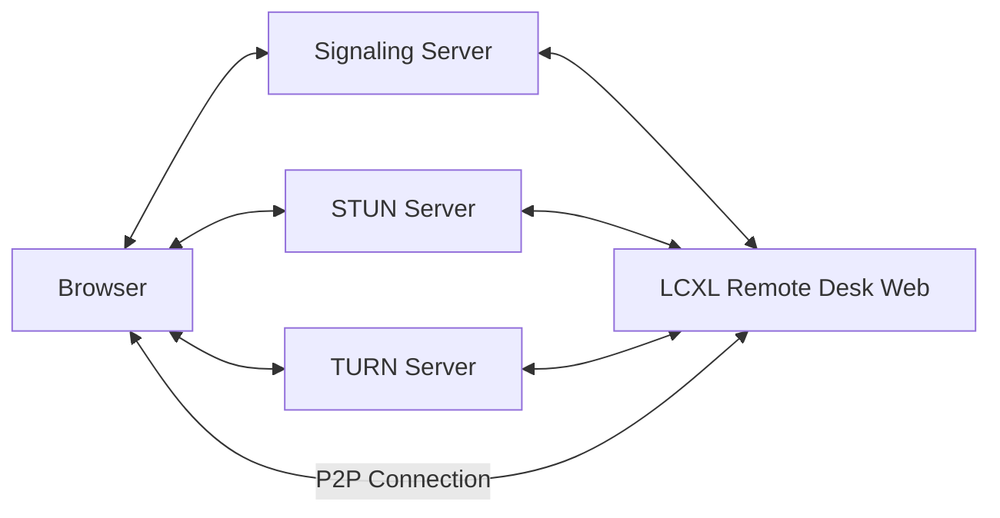

# LCXL Remote Desk Web——Web-based Remote Desktop

[中文](README_CN.md)

LCXL Remote Desk Web is a Web-based remote desktop solution that allows users to access and control remote computers through a web browser. The project uses WebRTC technology for efficient video streaming, with a Rust-based backend and a React-based frontend.

> [!WARNING]
> **Disclaimer**: This project is currently in its **early development stage**. The codebase may be unstable, contain unfixed bugs, or have incomplete features.
> **Security Risk Warning**: Remote desktop technology involves deep access to computer systems. When using this project for remote connections, please ensure your network environment is secure and be aware of potential security risks (e.g., unauthorized access, data leakage). The author(s) shall not be held liable for any damages or losses arising from the use of this project.

## Navigation

- 📖 [Development Guide](DEVELOPMENT.md) - Environment setup, workflow, API documentation
- ⚙️ [Configuration](DEVELOPMENT.md#configuration-details) - Server parameters
- 🚀 [Quick Start](#quick-start) - Run guide

## Network Architecture



Components (all integrated within LCXL Remote Desk Web):

1. **Signaling Server**: Coordinates the connection between browser and remote desktop.
2. **STUN Server**: Retrieves network address information for NAT traversal.
3. **TURN Server**: Relays data when P2P connection cannot be established.
4. **LCXL Remote Desk Web (server)**: The remote desktop backend service.

## Features

- **Remote Desktop Access**: Access and control remote desktops via browser, no extra client required.
- **File Transfer**: Transfer files between local and remote computers.
- **Terminal Control**: Command-line interface directly in the browser.

## Roadmap

- [ ] **Screen Sharing**: Share browser windows with other users for collaboration.
- [ ] **Camera Control**: Control and stream remote cameras via browser.
- [ ] **Shared Camera**: Support multiple users viewing the same camera stream.

## Quick Start

### Running the Server

1. **Clone the repository**

```bash
git clone <repository-url>
cd lcxl-remote-desk-web
```

1. **Run the server**

```bash
cargo run --release
```

1. **Access the Web Interface**
Open browser at: `http://localhost:8081`

Default credentials:

- Username: `admin`
- Password: `admin` (A random password is automatically generated on first startup)

## Docker Usage

### Using Docker Compose (Recommended)

```bash
docker-compose up -d
```

### Building Docker Image

```bash
# Default build
./build_docker.sh

# Build with mirror for speed
./build_docker.sh --mirror
```

## Configuration

Detailed configuration options are available in the [Development Guide](DEVELOPMENT.md#configuration-details).

## License

See the LICENSE file for details.
