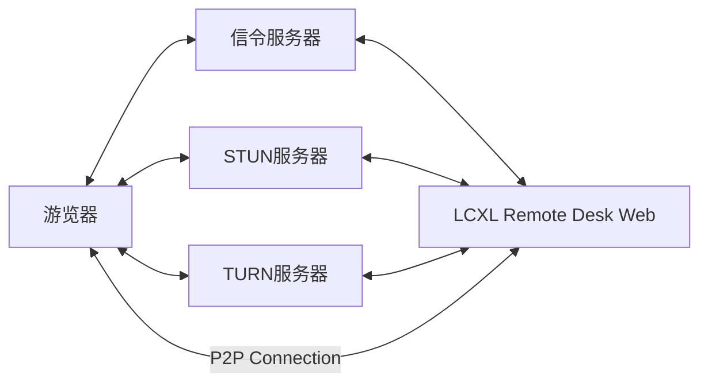

# LCXL Remote Desk Web——基于 Web 的远程桌面

LCXL Remote Desk Web 是一个基于 Web 技术的远程桌面解决方案，允许用户只通过浏览器访问和控制远程计算机。这个项目使用 WebRTC 技术来实现高效的视频流传输，后端使用 Rust 语言开发，前端则采用 React 框架。

## 文档导航

- 📖 [开发指南](DEVELOPMENT.md) - 环境配置、开发流程、API 文档
- ⚙️ [配置说明](#配置说明) - 服务器配置参数
- 🚀 [快速开始](#快速开始) - 快速运行指南

## 技术栈

### 后端
- **语言**: Rust (Edition 2024, Rust 1.90+)
- **Web 框架**: Actix-Web 4.11
- **WebRTC**: webrtc-rs 0.13
- **会话管理**: Actix-Session with Cookie
- **日志**: env_logger 0.11
- **配置管理**: config 0.15 (TOML)
- **API 文档**: Utoipa 5 (支持 Swagger, Redoc, RapiDoc, Scalar)
- **TURN 服务**: turn-server 3.4
- **Prometheus 监控**: Prometheus 0.13.4

### 前端
- **框架**: React 18
- **UI 组件**: Ant Design 5.13 + Ant Design Pro Components 2.6
- **构建工具**: UmiJS Max 4.1
- **语言**: TypeScript 5.3
- **终端模拟**: xterm.js 5.5
- **WebSocket**: WebSocket 1.0

### 多媒体处理
- **视频捕获**: Windows (DirectX), Linux (X11RB)
- **视频编码**: VP8, VP9 (libvpx)
- **音频捕获**: Windows (WASAPI), Linux (ALSA, PipeWire)
- **音频编码**: Opus (libopus)

## 项目结构

```
lcxl-remote-desk-web/
├── server/                    # 主服务器应用
│   └── src/
│       ├── controller/        # 控制器
│       │   ├── files.rs       # 文件传输
│       │   ├── info.rs        # 系统信息
│       │   ├── login.rs       # 用户登录
│       │   ├── settings.rs    # 设置管理
│       │   ├── signaling.rs   # WebRTC 信令
│       │   ├── terminal.rs    # 终端控制
│       │   ├── turn.rs        # TURN 服务器管理
│       │   └── user.rs        # 用户管理
│       ├── model/             # 数据模型
│       ├── service/           # 业务逻辑
│       └── main.rs            # 应用入口
├── signal-facade/             # 信令门面
├── signal/                    # 信令服务
├── turn/                      # TURN 服务
├── utils/                     # 工具库
├── server-version/            # 服务器版本
├── server-user/               # 服务器用户
├── third-deps/                # 第三方依赖
│   └── vpx-encode/           # VP8/VP9 编码器
├── static/                    # 前端应用 (React + Ant Design Pro)
│   └── src/                  # 前端源码
├── conf/                      # 配置文件
│   └── config.toml           # 主配置文件
├── assembly/                  # 构建脚本
└── Cargo.toml                # Rust 工作空间配置
```

## 网络架构图

LCXL Remote Desk Web 的网络架构图如下：



上面除了游览器以外有4个组件：

1. **信令服务器 (Signaling Server)**: 用于协调浏览器和远程桌面之间的连接，帮助建立 WebRTC 连接。
2. **STUN 服务器**: 用于获取网络地址信息，帮助解决 NAT 遍历问题。
3. **TURN 服务器**: 当 P2P 连接无法直接建立时，TURN 服务器作为中继服务器来传输数据。
4. **LCXL Remote Desk Web (server)**: 远程桌面的后端服务，使用 Rust 开发。

上面4个组件其实都集成在 LCXL Remote Desk Web 中。可以根据实际需求进行配置和扩展。

在远程桌面有公网IP或者在同一个局域网的情况下，浏览器可以直接与远程桌面建立 P2P 连接，不需要 TURN 服务器。在这种情况下，网络架构图如下：


## 功能描述

LCXL Remote Desk Web 提供了以下功能：

- **远程桌面访问**：用户可以通过浏览器访问远程计算机的桌面环境，无需安装额外的客户端软件。
- **文件传输**：支持在本地和远程计算机之间传输文件，方便用户进行文件管理操作。
- **终端控制**：提供命令行终端，用户可以直接在浏览器中执行命令，与远程计算机进行交互。
- **共享屏幕**：可以将游览器窗口共享给其他用户，实现多人协作和屏幕共享。
- **摄像头控制**：允许用户通过浏览器控制远程计算机的摄像头，实现视频监控或远程协助功能。
- **共享摄像头**：支持多个用户同时观看同一个摄像头画面，方便团队协作和会议使用。

## 快速开始

### 运行服务器

1. **下载或克隆项目**
```bash
git clone <repository-url>
cd lcxl-remote-desk-web
```

2. **运行服务器**
```bash
cargo run --release
```

3. **访问 Web 界面**
打开浏览器访问：`http://localhost:8081`

默认登录凭据：
- 用户名: `admin`
- 密码: `admin` (首次启动时会自动生成随机密码)

> 💡 **开发者提示**: 如需进行开发，请查看 [开发指南](DEVELOPMENT.md) 了解详细的环境配置和开发流程。

## 配置说明

> 📚 **开发者**: 查看 [开发指南](DEVELOPMENT.md) 获取详细的开发配置说明和 API 文档。

### 服务器配置 (conf/config.toml)

**系统设置 [system]**
- `enable_ipv6`: 是否启用 IPv6 支持
- `port`: 服务器监听端口
- `listen_addr_ipv4`: IPv4 监听地址
- `listen_addr_ipv6`: IPv6 监听地址
- `log_level`: 日志级别 (error, warn, info, debug, trace)
- `traceback`: 是否启用 Rust 错误回溯
- `open_browser_on_startup`: 启动时是否自动打开浏览器

**用户设置 [user]**
- `login_user_name`: 登录用户名
- `login_password`: 登录密码

**TURN 服务器 [turn]**
- `realm`: TURN 服务器域
- `interfaces`: 网络接口配置 (支持 UDP/TCP)
- `static_credentials`: 静态凭据配置

**桌面设置 [desk]**
- `video_fps`: 视频帧率 (默认 60)
- `video_encoder`: 视频编码器 (VP8/VP9)
- `audio_encoder`: 音频编码器 (OPUS)
- `video_device_index`: 视频设备索引
- `show_mouse`: 是否显示鼠标

## 命令行参数

```bash
cargo run -- --help
```

可用参数：
- `-c, --config-file-path <PATH>`: 配置文件路径 (默认: conf/config)
- `-m, --startup-mode <MODE>`: 启动模式
  - `default`: 默认模式，包含信令和桌面服务器
  - `signaling`: 仅信令模式 (信令 + TURN)
  - `desk-server`: 仅桌面服务器

## 许可证

请参阅 LICENSE 文件了解详细信息。

