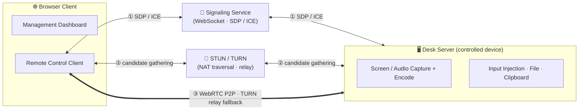
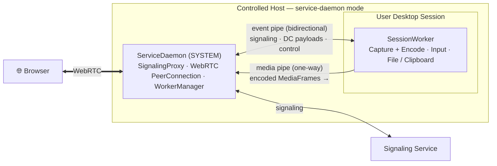
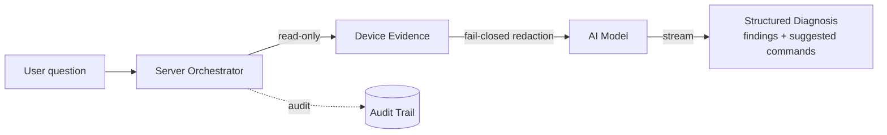

# LCXL Remote Desk Web —— AI-Native WebRTC Remote Desktop

[English](README.md) | [中文](README_CN.md)

LCXL Remote Desk Web is an **AI-native**, WebRTC-based remote desktop solution. On top of high-performance browser-only remote control, it builds in an **AI agent that can read a device's live state and diagnose problems** — and exposes those same read capabilities to external AI assistants through a read-only [MCP](https://modelcontextprotocol.io/) server. The AI layer is **model-agnostic** (works with OpenAI-compatible and Anthropic APIs) and **security-first** (the server is the single source of truth, the model can only *suggest* by default, evidence is redacted fail-closed, and every call is audited). The backend is written in Rust, and the frontend is built with React + Vite + Tailwind CSS.

> [!WARNING]
> **Disclaimer**: This project is currently in the **early development stage**. The codebase may be unstable, contain unfixed bugs, or have incomplete features.
> **Security Warning**: Remote desktop technology involves deep access to computer systems. Ensure your network environment is secure when using this project. The author(s) shall not be held liable for any damages arising from the use of this project.

---

## ✨ Key Features

- 🤖 **AI-Native Diagnosis**: Ask a question in plain language and the built-in AI agent collects **read-only** evidence from the device (system info, processes, listening ports, services, recent logs, containers, current screenshot), redacts secrets, and streams back a structured diagnosis with findings and *suggested* commands. Model-agnostic across **OpenAI-compatible** and **Anthropic** APIs.
- 🔌 **Read-Only MCP Server**: Run with `--startup-mode mcp-stdio` to expose the device's read capabilities (system info / process list / network ports / recent logs / one-shot diagnose) to a local AI assistant over the Model Context Protocol. The tool set is a static whitelist — **no exec / write / control tool exists**.
- 🛡️ **Security-First Agent Protocol**: A device-facing capability protocol where the **server is the source of truth** for every trusted field (target / scope / risk / approval). The default execution mode is *suggest-only*; higher-risk actions require explicit confirmation. Evidence redaction is **fail-closed**, API keys stay server-side, and every AI call is **audited** (content-free summaries only).
- 🖥️ **High-Performance Desktop Connection**: Based on WebRTC video streams, supporting AV1 (rav1e) / H.264 (x264 / OpenH264) / VP8 / VP9 software & hardware encoding, with Opus audio, for ultra-low latency.
- ⌨️ **Full-Featured Terminal**: Built-in remote terminal powered by xterm.js, supporting full shell interaction.
- 📂 **File Management System**: Supports file uploads, downloads, deletions, and a **Recycle Bin** mechanism to prevent accidental loss.
- 📋 **Bidirectional Clipboard**: Synchronize text clipboards between local and remote.
- 🎨 **Remote Whiteboard**: Draw and annotate directly on the remote screen, ideal for presentations and collaboration (requires `tauri-app`).
- 🔒 **Privacy Screen Mode**: Lock local display and input to ensure privacy during remote operations (requires `tauri-app`).
- 🔊 **Audio Support**: Captures remote audio and synchronizes it for playback.
- 🌐 **Multi-language Support (i18n)**: UI and documentation support both English and Chinese.

---

## 🚀 Quick Start

### Option 1: Docker Deployment (Recommended for Most Users)

One-click startup with Docker Compose:

```bash
docker-compose up -d
```

Access `http://localhost:8081` after startup. Admin setup is required on first access, then you are ready to go.

### Option 2: Tauri Desktop Client

For scenarios requiring locally-rendered enhancements such as "Privacy Screen" or "Whiteboard":

```bash
cd tauri-app
cargo tauri dev
```

### Option 3: Run from Source (For Developers)

1. **Prerequisites**:
   - Install [Rust](https://www.rust-lang.org/) (latest stable)
   - Install [Node.js](https://nodejs.org/) (the frontend uses npm)
   - **AV1 Support (Optional but Recommended)**: To use AV1 encoding, you need to install [nasm](https://www.nasm.us/).
     Windows installation example:
     ```bash
     $NASM_VERSION="2.15.05" # or newer
     $LINK="https://www.nasm.us/pub/nasm/releasebuilds/$NASM_VERSION/win64"
     curl --ssl-no-revoke -LO "$LINK/nasm-$NASM_VERSION-win64.zip"
     7z e -y "nasm-$NASM_VERSION-win64.zip" -o "C:\nasm"
     # set path for the current session
     set PATH="%PATH%;C:\nasm"
     ```

2. **Start Backend** (Signaling and Desktop services enabled by default):
   ```bash
   cargo run --release
   ```

3. **Start Frontend**:
   ```bash
   cd vite-project
   npm ci
   npm run dev
   ```
   Access `http://localhost:5174`.

---

## ⚙️ Key Configuration

The project is fine-tuned via `conf/config.toml`. Key parameters:

- **System**: listen address, port, log level, etc.
- **Desktop / Encoding**: frame rate, video encoder (X264 / VP8 / VP9 / H264 / AV1), cursor visibility, etc. — applied per session when a connection is initiated.
- **AI Model**: Configure the AI provider, base URL, model name, and API key on the management console's AI settings page. The API key is a **server-side secret** and is never returned to the browser or written to logs. Both OpenAI-compatible and Anthropic gateways are supported, switchable at runtime.
- **Mode Switching**: Use `--startup-mode` (short `-s`) to toggle between `default`, `signaling`, `desk-server`, `service-daemon`, `session-worker`, and `mcp-stdio` modes; the config file defaults to `conf/config.toml` (set via `-c` / `--config-file-path`).

> 📚 For more details, refer to the [Development Guide (DEVELOPMENT.md)](DEVELOPMENT.md).

---

## 📡 How It Works

### Connection & media path



The browser and the remote desk service first exchange SDP / ICE through the **signaling service** (a WebSocket connection), gather candidates via **STUN/TURN**, then establish a direct **WebRTC P2P** connection whenever possible — falling back to **TURN relay** only when NAT traversal fails. Signaling and TURN are integrated into `server` by default, so a single binary covers public and local-network deployments.

Once the peer connection is up, everything rides over it: **video track(s)** (AV1 / H.264 / VP8 / VP9, with dirty-rectangle incremental encoding), an **Opus audio track**, and a set of **data channels** for mouse, keyboard, file transfer, clipboard, and whiteboard. The remote terminal runs over its own channel.

### Process model

`server` runs in several startup modes (`--startup-mode`). The simplest — `default` / `desk-server` — keeps the whole pipeline (WebRTC, capture/encode, input injection) in **one process**. To capture the Windows login / UAC / lock screen, the `service-daemon` mode splits the work across a privilege boundary:



The **ServiceDaemon** (SYSTEM account) owns the WebRTC peer connection, the signaling proxy, and the worker lifecycle. It spawns a **SessionWorker** inside each interactive desktop session to do the actual screen/audio capture, encoding, and input injection. The two are linked by two IPC pipes (named pipes on Windows / Unix sockets elsewhere): a **bidirectional event pipe** (signaling, data-channel payloads, control — never dropped) and a **one-way media pipe** (encoded `MediaFrame`s flowing worker → daemon, which writes them onto the WebRTC tracks). This lets a session worker restart on session switch without tearing down the browser's connection.

---

## 🤖 AI Native

Remote control is only half the story — the device's *state* should be just as accessible to an AI as the screen is to a human. LCXL Remote Desk treats AI as a first-class control end alongside the browser.

**AI Diagnose (in the web client).** During a session, ask a question (e.g. *"why is this machine slow?"*). The server-side orchestrator runs a fixed pipeline: **collect → redact → model → render**.



- **Read-only evidence collectors**: system info, process list, listening ports, service status, recent logs, container list / inspect / logs, and current screenshot.
- **Model-agnostic**: an adapter layer isolates the wire protocol, so the same orchestrator drives OpenAI-compatible and Anthropic gateways; the provider is switchable per call.
- **Suggest-only by default**: the model proposes commands but does not run them; execution requires an explicit, server-mediated confirmation.
- **Standalone or centralized**: the diagnose logic (capability selection / prompt assembly / response parsing / evidence chunking) is factored into a shared `desk-diagnose-core` crate. A desk-server can either run the full orchestrator in-process (as shown above) or serve only redacted, **read-only evidence** (`CollectRequest` / `CollectResponse` signaling) to an external "central brain" that does the orchestration and model call — enabling a "thin edge + central brain" fleet deployment where credentials such as the API key stay centralized instead of being pushed to every edge.

**MCP server (for external AI assistants).** Running with `--startup-mode mcp-stdio` turns the device into a Model Context Protocol server over stdio, exposing a **static whitelist of read-only tools**: `lcxl_system_info`, `lcxl_process_list`, `lcxl_network_ports`, `lcxl_recent_logs` (policy-gated), and `lcxl_diagnose` (gated on model configuration). There is deliberately no exec / write / control tool, and `lcxl_diagnose` carries no screenshot option — an MCP client structurally cannot capture the screen.

**Security model.** The capability protocol is device-facing and client-agnostic: the server injects and validates every trusted field (target, actor, scope, risk, approval) — a control end can never self-report them. Evidence redaction is fail-closed (a redactor failure aborts before the model is called), API keys never leave the server, and the audit trail records content-free summaries (counts / sizes / token usage), never raw output or prompts.

---

## 🧩 Project Structure

From a user's perspective, the project comes in three forms:

- **`server`**: The headless remote desktop service with built-in signaling and TURN, suitable for server / command-line deployments. It supports multiple startup modes (full, signaling-only, desk-server-only, and more).
- **`tauri-app`**: A GUI-enabled desktop edition that adds locally-rendered features such as Privacy Screen and Whiteboard on top of `server`.
- **`vite-project`**: The browser-based web frontend, serving as both the management dashboard and the remote client.

> The remaining crates are internal libraries (screen / audio capture and encoding, input injection, signaling protocol, IPC, etc.). See the [Development Guide (DEVELOPMENT.md)](DEVELOPMENT.md) for the full module breakdown.

---

## 🗺️ Roadmap

- [x] High-performance WebRTC desktop streaming
- [x] Cross-platform support (Linux/Windows/MacOS)
- [x] Remote terminal and file management
- [x] Privacy Screen and Whiteboard features
- [x] AI-native diagnosis (model-agnostic: OpenAI-compatible / Anthropic)
- [x] Read-only MCP server for external AI assistants
- [ ] AI command execution with confirmation & guardrails
- [ ] Mobile interface optimization
- [ ] RBAC (Role-Based Access Control) system
- [ ] Session recording support

---

## 📄 License

This project is licensed under the [Apache-2.0](LICENSE) License.
