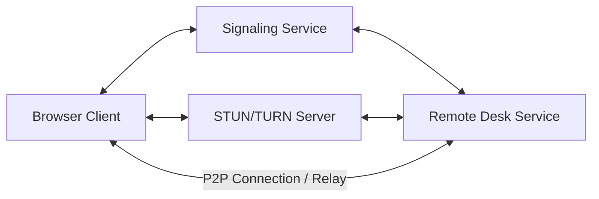

# LCXL Remote Desk Web —— Efficient WebRTC-based Remote Desktop

[English](README.md) | [中文](README_CN.md)

LCXL Remote Desk Web is a modern remote desktop solution leveraging WebRTC technology. It allows users to gain high-performance access and control of remote computers through just a web browser, eliminating the need for any plugins or dedicated client software for management. The backend is written in Rust, and the frontend is built with React + Vite + Tailwind CSS.

> [!WARNING]
> **Disclaimer**: This project is currently in the **early development stage**. The codebase may be unstable, contain unfixed bugs, or have incomplete features.
> **Security Warning**: Remote desktop technology involves deep access to computer systems. Ensure your network environment is secure when using this project. The author(s) shall not be held liable for any damages arising from the use of this project.

---

## 🏗️ Core Architecture & Modules

The project is designed with modularity to meet various deployment requirements:

*   **`server`**: The core remote desktop service running on the host machine (Windows/Linux/MacOS). It handles screen capture, audio collection, command execution, and file management (CLI-only version).
*   **`signal`**: The signaling server. Enabled by default within `server`, but can also be deployed independently. It uses WebSocket to coordinate peer connections.
*   **`vite-project`**: The web frontend application. Serves as both the management dashboard and the remote client.
*   **`tauri-app`**: An enhanced server version with a GUI. It provides features that require local UI visibility, such as Privacy Screen and Whiteboard.
*   **`turn`**: Integrated TURN/STUN services (currently bundled with the signaling service) to ensure NAT traversal in complex network environments.
*   **`utils`**: Common utility packages.
*   **`signal-facade`**: Interface definitions for the signaling service.

---

## ✨ Key Features

- 🖥️ **High-Performance Desktop Connection**: Based on WebRTC video streams, supporting H264/VP8/VP9 hardware/software encoding for ultra-low latency.
- ⌨️ **Full-Featured Terminal**: Built-in remote terminal powered by xterm.js, supporting full shell interaction.
- 📂 **File Management System**: Supports file uploads, downloads, deletions, and a **Recycle Bin** mechanism to prevent accidental loss.
- 📋 **Bidirectional Clipboard**: Synchronize text clipboards between local and remote.
- 🎨 **Remote Whiteboard**: Draw and annotate directly on the remote screen, ideal for presentations and collaboration (requires `tauri-app`).
- 🔒 **Privacy Screen Mode**: Lock local display and input to ensure privacy during remote operations (requires `tauri-app`).
- 🔊 **Audio Support**: Captures remote audio and synchronizes it for playback.
- 🌐 **Multi-language Support (i18n)**: UI and documentation support both English and Chinese.

---

## 📡 Network Architecture



> **Note**: Signaling and TURN servers are integrated into the `server` by default. Direct P2P connections are prioritized in public or local network environments.

---

## 🚀 Quick Start

### Option 1: Run from Source (Recommended for Developers)

1. **Prerequisites**:
   - Install [Rust](https://www.rust-lang.org/) (latest stable)
   - Install [Node.js](https://nodejs.org/) and [pnpm](https://pnpm.io/)

2. **Start Backend**:
   ```bash
   # Run in the server directory (starts Signaling and Desktop services by default)
   cargo run --release
   ```

3. **Start Frontend**:
   ```bash
   cd vite-project
   npm ci
   npm run dev
   ```
   Access `http://localhost:5174`.

### Option 2: Docker Deployment

One-click deployment using Docker Compose is recommended:

```bash
docker-compose up -d
```
Access `http://localhost:8081` after startup. Admin setup is required on first access.

### Option 3: Tauri Desktop Client

For scenarios requiring "Privacy Screen" or "Whiteboard" features:
```bash
cd tauri-app
cargo tauri dev
```

---

## ⚙️ Key Configuration

The project is fine-tuned via `conf/config.toml`. Key parameters:

- **System**: `listen_addr`, `log_level`, `port`.
- **Desktop**: `fps`, `encoder_type` (vpx/openh264/manual), `show_cursor`.
- **Mode Switching**: Use the `-m` flag to toggle between `default`, `signaling`, or `desk-server` modes.

> 📚 For more details, refer to the [Development Guide (DEVELOPMENT.md)](DEVELOPMENT.md).

---

## 🗺️ Roadmap

- [x] High-performance WebRTC desktop streaming
- [x] Cross-platform support (Linux/Windows/MacOS)
- [x] Remote terminal and file management
- [x] Privacy Screen and Whiteboard features
- [ ] Mobile interface optimization
- [ ] RBAC (Role-Based Access Control) system
- [ ] Session recording support

---

## 📄 License

This project is licensed under the [Apache-2.0](LICENSE) License.
