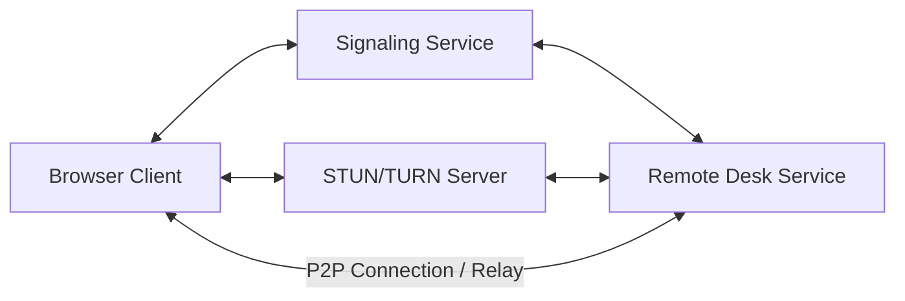

# LCXL Remote Desk Web —— Efficient WebRTC-based Remote Desktop

[English](README.md) | [中文](README_CN.md)

LCXL Remote Desk Web is a modern remote desktop solution leveraging WebRTC technology. It allows users to gain high-performance access and control of remote computers through just a web browser, eliminating the need for any plugins or dedicated client software for management. The backend is written in Rust, and the frontend is built with React + Vite + Tailwind CSS.

> [!WARNING]
> **Disclaimer**: This project is currently in the **early development stage**. The codebase may be unstable, contain unfixed bugs, or have incomplete features.
> **Security Warning**: Remote desktop technology involves deep access to computer systems. Ensure your network environment is secure when using this project. The author(s) shall not be held liable for any damages arising from the use of this project.

---

## ✨ Key Features

- 🖥️ **High-Performance Desktop Connection**: Based on WebRTC video streams, supporting AV1 (rav1e) / H.264 (x264 / OpenH264) / VP8 / VP9 software & hardware encoding, with Opus audio, for ultra-low latency.
- ⌨️ **Full-Featured Terminal**: Built-in remote terminal powered by xterm.js, supporting full shell interaction.
- 📂 **File Management System**: Supports file uploads, downloads, deletions, and a **Recycle Bin** mechanism to prevent accidental loss.
- 📋 **Bidirectional Clipboard**: Synchronize text clipboards between local and remote.
- 🎨 **Remote Whiteboard**: Draw and annotate directly on the remote screen, ideal for presentations and collaboration (requires `tauri-app`).
- 🔒 **Privacy Screen Mode**: Lock local display and input to ensure privacy during remote operations (requires `tauri-app`).
- 🔊 **Audio Support**: Captures remote audio and synchronizes it for playback.
- 🌐 **Multi-language Support (i18n)**: UI and documentation support both English and Chinese.

---

## 🚀 Quick Start

### Option 1: Docker Deployment (Recommended for Most Users)

One-click startup with Docker Compose:

```bash
docker-compose up -d
```

Access `http://localhost:8081` after startup. Admin setup is required on first access, then you are ready to go.

### Option 2: Tauri Desktop Client

For scenarios requiring locally-rendered enhancements such as "Privacy Screen" or "Whiteboard":

```bash
cd tauri-app
cargo tauri dev
```

### Option 3: Run from Source (For Developers)

1. **Prerequisites**:
   - Install [Rust](https://www.rust-lang.org/) (latest stable)
   - Install [Node.js](https://nodejs.org/) (the frontend uses npm)
   - **AV1 Support (Optional but Recommended)**: To use AV1 encoding, you need to install [nasm](https://www.nasm.us/).
     Windows installation example:
     ```bash
     $NASM_VERSION="2.15.05" # or newer
     $LINK="https://www.nasm.us/pub/nasm/releasebuilds/$NASM_VERSION/win64"
     curl --ssl-no-revoke -LO "$LINK/nasm-$NASM_VERSION-win64.zip"
     7z e -y "nasm-$NASM_VERSION-win64.zip" -o "C:\nasm"
     # set path for the current session
     set PATH="%PATH%;C:\nasm"
     ```

2. **Start Backend** (Signaling and Desktop services enabled by default):
   ```bash
   cargo run --release
   ```

3. **Start Frontend**:
   ```bash
   cd vite-project
   npm ci
   npm run dev
   ```
   Access `http://localhost:5174`.

---

## ⚙️ Key Configuration

The project is fine-tuned via `conf/config.toml`. Key parameters:

- **System**: listen address, port, log level, etc.
- **Desktop / Encoding**: frame rate, video encoder (X264 / VP8 / VP9 / H264 / AV1), cursor visibility, etc. — applied per session when a connection is initiated.
- **Mode Switching**: Use `--startup-mode` (short `-s`) to toggle between `default`, `signaling`, `desk-server`, `service-daemon`, and `session-worker` modes; the config file defaults to `conf/config.toml` (set via `-c` / `--config-file-path`).

> 📚 For more details, refer to the [Development Guide (DEVELOPMENT.md)](DEVELOPMENT.md).

---

## 📡 How It Works



The browser and the remote desk service exchange connection information through the signaling service, then use STUN/TURN for NAT traversal to establish a direct P2P connection whenever possible, falling back to relay when necessary. The signaling and TURN servers are integrated into `server` by default, and direct P2P connections are prioritized in public or local network environments.

---

## 🧩 Project Structure

From a user's perspective, the project comes in three forms:

- **`server`**: The headless remote desktop service with built-in signaling and TURN, suitable for server / command-line deployments. It supports multiple startup modes (full, signaling-only, desk-server-only, and more).
- **`tauri-app`**: A GUI-enabled desktop edition that adds locally-rendered features such as Privacy Screen and Whiteboard on top of `server`.
- **`vite-project`**: The browser-based web frontend, serving as both the management dashboard and the remote client.

> The remaining crates are internal libraries (screen / audio capture and encoding, input injection, signaling protocol, IPC, etc.). See the [Development Guide (DEVELOPMENT.md)](DEVELOPMENT.md) for the full module breakdown.

---

## 🗺️ Roadmap

- [x] High-performance WebRTC desktop streaming
- [x] Cross-platform support (Linux/Windows/MacOS)
- [x] Remote terminal and file management
- [x] Privacy Screen and Whiteboard features
- [ ] Mobile interface optimization
- [ ] RBAC (Role-Based Access Control) system
- [ ] Session recording support

---

## 📄 License

This project is licensed under the [Apache-2.0](LICENSE) License.
