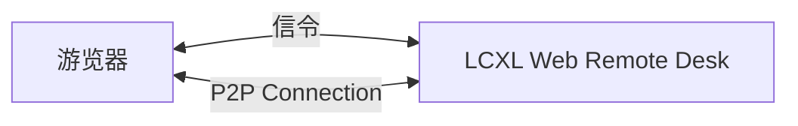

# LCXL Web Remote Desk——基于 Web 的远程桌面

LCXL Web Remote Desk 是一个基于 Web 技术的远程桌面解决方案，允许用户只通过浏览器访问和控制远程计算机。这个项目使用 WebRTC 技术来实现高效的视频流传输，后端使用 Rust 语言开发，前端则采用 React 框架。

## 网络架构图

LCXL Web Remote Desk 的网络架构图如下：


上面除了游览器以外有4个组件：
1. **信令服务器 (Signaling Server)**: 用于协调浏览器和远程桌面之间的连接，帮助建立 WebRTC 连接。
2. **STUN 服务器**: 用于获取网络地址信息，帮助解决 NAT 遍历问题。
3. **TURN 服务器**: 当 P2P 连接无法直接建立时，TURN 服务器作为中继服务器来传输数据。
4. **LCXL Web Remote Desk (desk)**: 远程桌面的后端服务，使用 Rust 开发。

上面4个组件其实都集成在 LCXL Web Remote Desk 中。可以根据实际需求进行配置和扩展。

在远程桌面有公网IP或者在同一个局域网的情况下，浏览器可以直接与远程桌面建立 P2P 连接，不需要 TURN 服务器。在这种情况下，网络架构图如下：



## 功能描述

LCXL Web Remote Desk 提供了以下功能：
- **远程桌面访问**：用户可以通过浏览器访问远程计算机的桌面环境，无需安装额外的客户端软件。
- **文件传输**：支持在本地和远程计算机之间传输文件，方便用户进行文件管理操作。
- **终端控制**：提供命令行终端，用户可以直接在浏览器中执行命令，与远程计算机进行交互。
- **共享屏幕**：可以将游览器窗口共享给其他用户，实现多人协作和屏幕共享。
- **摄像头控制**：允许用户通过浏览器控制远程计算机的摄像头，实现视频监控或远程协助功能。
- **共享摄像头**：支持多个用户同时观看同一个摄像头画面，方便团队协作和会议使用。


## 应用开发

### Windows 调试环境配置

在 Windows 上进行 Rust 开发和调试，推荐使用 Visual Studio Code (VSCode) 和 LLDB 调试器。不过 Rust 在 Windows 平台默认的工具链是 MSVC 工具链，而 LLDB 针对 MSVC 工具链支持不太好，可以查看以下 issue： https://github.com/vadimcn/codelldb/wiki/Windows#debugging-rust-on-windows 

因此如果需要在 VSCode 中使用 LLDB 调试 Rust 项目，建议安装 MSYS2 。具体步骤如下：
* 参考 [MSYS2 官方文档](https://www.msys2.org/) 进行安装和配置。
* 安装 GCC 工具链（`pacman -S mingw-w64-ucrt-x86_64-gcc`）。
    * 如果需要ffmpeg的支持，则需要执行以下命令：`pacman -S mingw-w64-ucrt-x86_64-ffmpeg`
* 设置环境变量，将 MSYS2 下的 gcc 的 `bin` 目录添加到系统的 PATH 环境变量中。加入 MYSYS2 安装在 `C:\msys64` 中，则需要添加 `C:\msys64\ucrt64\bin` 到 PATH 中。
* 将 rust 的工具链切到 gnu 版本：
    * `rustup toolchain install stable-x86_64-pc-windows-gnu`
    * `rustup default stable-x86_64-pc-windows-gnu`

### MacOS 调试环境配置

当使用VS Code远程调试Mac OS上的Rust程序时，会报如下错误：`process exited with status -1 (this is a non-interactive debug session, cannot get permission to debug proesses.)`，参考此issue： https://github.com/vadimcn/codelldb/issues/1079 , 需要在MacOS上进行以下配置：
```bash
sudo security authorizationdb write system.privilege.taskport.debug allow
```


### Windows 使用DXGI API捕获屏幕

参考文档：

https://learn.microsoft.com/zh-cn/windows/win32/direct3ddxgi/desktop-dup-api

相关代码入口：https://github.com/microsoftarchive/msdn-code-gallery-microsoft/blob/21cb9b6bc0da3b234c5854ecac449cb3bd261f29/Official%20Windows%20Platform%20Sample/DXGI%20desktop%20duplication%20sample/%5BC%2B%2B%5D-DXGI%20desktop%20duplication%20sample/C%2B%2B/DuplicationManager.cpp#L56


## 其他

### GStreamer实现的基于webrtc的远程桌面控制

* 基本教程：https://gstreamer.freedesktop.org/documentation/tutorials/index.html?gi-language=c
* 运行于游览器的js项目：https://gitlab.freedesktop.org/gstreamer/gst-plugins-rs/-/tree/main/net/webrtc/gstwebrtc-api
* 服务端实现：https://gitlab.freedesktop.org/gstreamer/gst-plugins-rs/-/blob/main/net/webrtc/src/webrtcsink/imp.rs
    * enable-data-channel-navigation=true