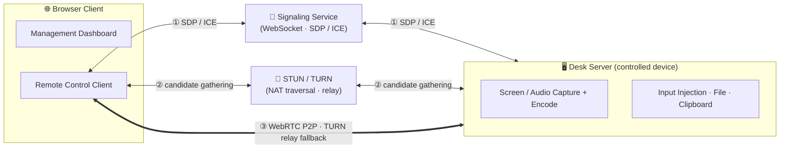
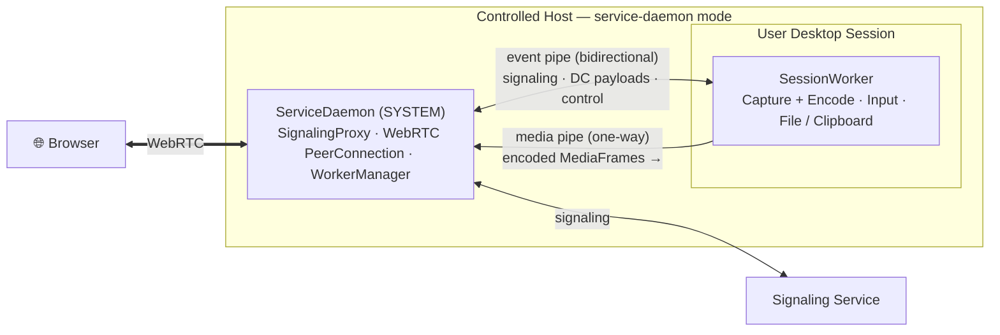
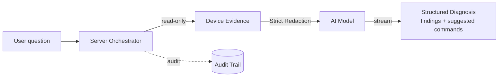

# LCXL Remote Desk Web

[English](README.md) | [中文](README_CN.md)

LCXL Remote Desk Web is a high-performance, WebRTC-based remote desktop solution. Beyond standard browser-based remote control, it includes a built-in diagnostic AI assistant capable of analyzing the device's current state to troubleshoot issues. It also exposes these read capabilities to external AI tools via a read-only [MCP](https://modelcontextprotocol.io/) server. The AI integration is model-agnostic (supporting both OpenAI-compatible and Anthropic APIs) and prioritizes security: the server handles all permissions, the model defaults to providing suggestions rather than executing them, data is strictly redacted before transmission (blocking requests upon redaction failure), and all calls are audited. The backend is written in Rust, and the frontend is built with React + Vite + Tailwind CSS.

> [!WARNING]
> **Disclaimer**: This project is currently in the early development stage. The codebase may be unstable, contain unfixed bugs, or have incomplete features.
> **Security Warning**: Remote desktop technology involves deep access to computer systems. Ensure your network environment is secure when using this project. The author(s) shall not be held liable for any damages arising from the use of this project.

---

## Key Features

- **AI Diagnostics**: You can ask troubleshooting questions in plain language. The system automatically collects read-only state data (e.g., system info, processes, ports, logs), redacts sensitive information locally, and sends it to the AI model for analysis and suggested fixes. Supports OpenAI and Anthropic APIs.
- **Read-Only MCP Server**: Running `--startup-mode mcp-stdio` exposes the device's read capabilities to local AI assistants over the Model Context Protocol. The toolset is restricted to a static whitelist with no execution or write permissions.
- **Secure Access Control**: The server strictly controls all authorizations. The AI provides suggestions by default, and high-risk actions require manual confirmation. Evidence redaction operates strictly to prevent data leaks, and API keys are stored solely on the server.
- **High-Performance Streaming**: A WebRTC-based connection supporting AV1 / H.264 / VP8 / VP9 software and hardware encoding, combined with Opus audio for ultra-low latency.
- **Remote Terminal**: A built-in xterm.js terminal supporting full shell interactions.
- **File Management**: Supports file uploads, downloads, deletions, and a Recycle Bin mechanism.
- **Clipboard Sync**: Bidirectional synchronization for text clipboards.
- **Remote Whiteboard**: Draw and annotate on the remote screen for collaboration (requires `tauri-app`).
- **Privacy Screen**: Lock the local display and input to ensure privacy during remote operations (requires `tauri-app`).
- **System Audio**: Captures and synchronizes remote audio playback.
- **Multi-language Support**: UI and documentation are available in English and Chinese.

---

## Quick Start

### Option 1: Docker Deployment (Recommended)

Start the service using Docker Compose:

```bash
docker-compose up -d
```

Access `http://localhost:8081` and set up the admin account on your first visit.

### Option 2: Tauri Desktop Client

Use this if you need locally-rendered enhancements like the Privacy Screen or Whiteboard:

```bash
cd tauri-app
cargo tauri dev
```

### Option 3: Run from Source (For Developers)

1. **Prerequisites**:
   - Install the latest stable [Rust](https://www.rust-lang.org/).
   - Install [Node.js](https://nodejs.org/).
   - **AV1 Encoding (Optional)**: Requires [nasm](https://www.nasm.us/) on Windows:
     ```bash
     $NASM_VERSION="2.15.05"
     $LINK="https://www.nasm.us/pub/nasm/releasebuilds/$NASM_VERSION/win64"
     curl --ssl-no-revoke -LO "$LINK/nasm-$NASM_VERSION-win64.zip"
     7z e -y "nasm-$NASM_VERSION-win64.zip" -o "C:\nasm"
     set PATH="%PATH%;C:\nasm"
     ```

2. **Start Backend** (Signaling and Desktop services enabled by default):
   ```bash
   cargo run --release
   ```

3. **Start Frontend**:
   ```bash
   cd vite-project
   npm ci
   npm run dev
   ```
   Access `http://localhost:5174`.

---

## Configuration

Project settings are managed via `conf/config.toml`:

- **System**: Listen address, port, and log levels.
- **Desktop & Encoding**: Frame rate, video encoders (X264 / VP8 / VP9 / H264 / AV1), and cursor visibility, applied per session.
- **AI Settings**: Configure the provider, base URL, model, and API key via the management console. API keys are strictly server-side secrets.
- **Startup Modes**: Use `--startup-mode` (or `-s`) to toggle between modes like default, signaling, desk-server, service-daemon, and mcp-stdio. The config file path can be specified via `-c`.

> Refer to the [Development Guide (DEVELOPMENT.md)](DEVELOPMENT.md) for more details.

---

## How It Works

### Connection & Media Path



The browser and remote device exchange SDP / ICE through the signaling service and use STUN/TURN to gather candidate addresses. They prioritize a direct WebRTC P2P connection and only fallback to TURN relays if NAT traversal fails. Signaling and TURN are built into the server.

Once connected, video, Opus audio, and data channels (for input, clipboard, and file management) run over WebRTC. The remote terminal uses a dedicated data channel.

### Process Model

The `server` supports various modes. The default mode runs WebRTC, capturing, and input injection in a single process. To capture secure environments like the Windows UAC or lock screen, the service-daemon mode splits operations across privilege boundaries:



The ServiceDaemon (running as SYSTEM) manages the WebRTC connection, signaling, and child processes. It spawns a SessionWorker inside each desktop session to handle screen capturing and input injection. They communicate via a bidirectional event pipe (for signaling and control) and a one-way media pipe (for encoded frames). This allows session workers to restart during user switching without dropping the browser connection.

---

## AI Architecture

In addition to manual control, LCXL Remote Desk allows AI models to read and analyze the device's status.

**In-Client Diagnostics.** When a user asks a question during a session (e.g., "Why is this system slow?"), the server orchestrates a pipeline: collect state, redact data, call the model, and render the response.



- **Read-Only Data Collection**: Gathers system info, processes, ports, logs, and screenshots.
- **Model Agnostic**: Compatible with both OpenAI and Anthropic endpoints.
- **Suggest-Only Defaults**: The model proposes fixes, but execution requires explicit user confirmation.
- **Flexible Deployment**: Diagnostic logic is centralized in the `desk-diagnose-core` crate. Nodes can act as evidence collectors that send redacted data to a central server for inference, enabling secure API key management for fleet deployments.

**MCP Server.** Running `--startup-mode mcp-stdio` turns the device into an MCP server, offering a static whitelist of read-only tools to local AI assistants. To maintain security, screen capturing and control execution tools are completely excluded in this mode.

**Security Model.** All authorization logic is verified on the server side. Data redaction fails closed to prevent leaks, and audit trails only log metadata (e.g., payload size and token usage), ensuring raw prompts and outputs are never stored permanently.

---

## Project Structure

- **`server`**: The headless remote desktop service with integrated signaling and TURN.
- **`tauri-app`**: The GUI-enabled desktop client offering enhanced local features like Privacy Screen.
- **`vite-project`**: The React-based web frontend used for both management and remote access.

> Other modules handle capture, encoding, input injection, and IPC. See the [Development Guide (DEVELOPMENT.md)](DEVELOPMENT.md) for architectural details.

---

## Roadmap

- [x] High-performance WebRTC streaming
- [x] Cross-platform support (Linux/Windows/MacOS)
- [x] Remote terminal and file management
- [x] Privacy screen and whiteboard
- [x] AI system diagnostics (OpenAI / Anthropic support)
- [x] Read-only MCP server integration
- [ ] AI command execution with safety guardrails
- [ ] Mobile interface optimizations
- [ ] Role-Based Access Control (RBAC) and multi-user management
- [ ] Session recording support

---

## License

This project is licensed under the [Apache-2.0](LICENSE) License.
