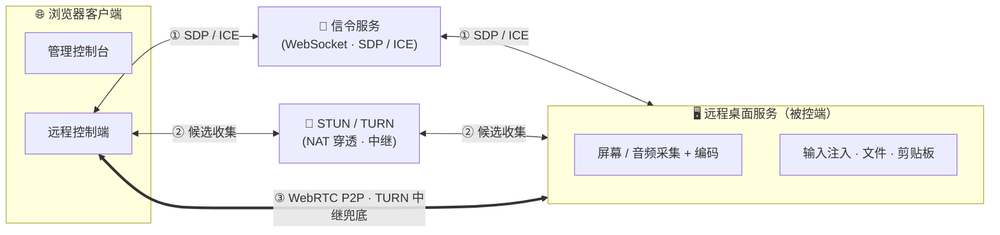
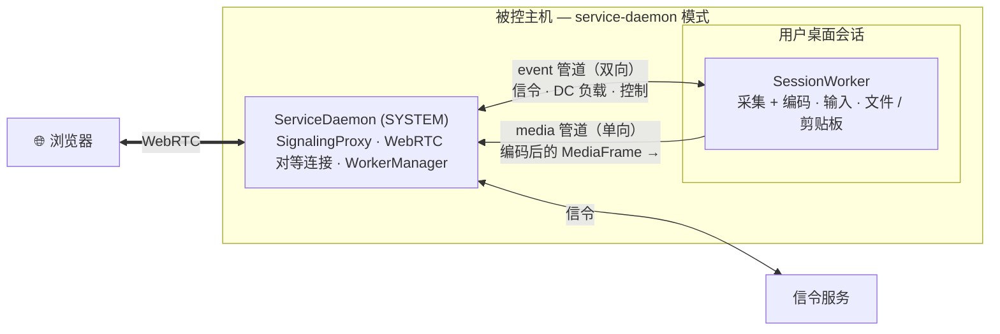
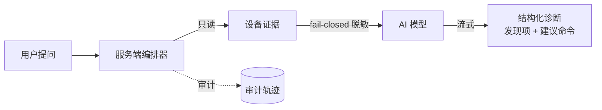

# LCXL Remote Desk Web —— AI 原生的 WebRTC 远程桌面

[English](README.md)

LCXL Remote Desk Web 是一个 **AI 原生（AI-Native）**、基于 WebRTC 技术的远程桌面解决方案。在「仅凭浏览器即可高性能远程控制」之上，它内置了一个**能读取设备实时状态并进行问题诊断的 AI Agent**，并通过一个**只读 [MCP](https://modelcontextprotocol.io/) 服务**把这些只读能力开放给外部 AI 助手。AI 层是**模型无关的**（兼容 OpenAI 兼容接口与 Anthropic 接口），且**安全优先**：服务端是唯一可信源、模型默认只能「给建议」、证据脱敏 fail-closed、每次调用都会审计。后端采用 Rust 编写，前端基于 React + Vite + Tailwind CSS 构建。

> [!WARNING]
> **免责声明**：本项目目前处于**早期开发阶段**，代码库可能存在不稳定性、未修复的漏洞或功能不完整的情况。
> **安全风险提示**：远程桌面技术涉及对计算机系统的深度访问。在使用本项目进行远程连接时，请务必确保网络环境安全。作者不对因使用本项目而导致的任何损害承担法律责任。

---

## ✨ 核心功能

- 🤖 **AI 原生诊断**：用自然语言提问，内置 AI Agent 即会从设备采集**只读**证据（系统信息、进程、监听端口、服务、近期日志、容器、当前截图），脱敏后调用模型，流式返回结构化诊断结果（发现项 + **建议**命令）。模型无关，兼容 **OpenAI 兼容**接口与 **Anthropic** 接口。
- 🔌 **只读 MCP 服务**：以 `--startup-mode mcp-stdio` 启动，即可把设备的只读能力（系统信息 / 进程列表 / 网络端口 / 近期日志 / 一次性诊断）通过 Model Context Protocol 开放给本地 AI 助手。工具集为静态白名单——**不存在任何执行 / 写入 / 控制类工具**。
- 🛡️ **安全优先的能力协议**：面向设备的能力协议中，**服务端是唯一可信源**，所有受信字段（目标 / 授权范围 / 风险 / 审批）均由服务端注入与校验。默认执行模式为「只给建议」，更高风险动作需显式确认。证据脱敏 **fail-closed**，API Key 仅驻留服务端，每次 AI 调用均**审计**（只记录无内容的摘要）。
- 🖥️ **高性能桌面连接**：基于 WebRTC 视频流，支持 AV1 (rav1e) / H.264 (x264 / OpenH264) / VP8 / VP9 软硬件编码，音频采用 Opus，极速低延迟。
- ⌨️ **功能完备的终端**：内置基于 xterm.js 的远程终端，完美支持 shell 交互。
- 📂 **文件管理系统**：支持文件的上传、下载、删除及**回收站**功能，轻松同步数据。
- 📋 **双向剪贴板**：支持文本剪贴板同步。
- 🎨 **远程白板**：允许在远端屏幕上进行标注与绘画，适合远程演示与协作（需 `tauri-app`）。
- 🔒 **隐私屏模式**：锁定本地显示器与输入，确保远程操作的私密性（需 `tauri-app`）。
- 🔊 **音频支持**：支持远程音频捕获与同步播放。
- 🌐 **多语言支持 (i18n)**：界面及文档支持中英文切换。

---

## 🚀 快速开始

### 方式 1：Docker 部署（推荐普通用户）

使用 Docker Compose 一键启动：

```bash
docker-compose up -d
```

启动后访问 `http://localhost:8081`，首次访问需设置管理员账号即可开始使用。

### 方式 2：Tauri 桌面客户端

适用于需要“隐私屏”“白板”等依赖本地显示的增强功能的场景：

```bash
cd tauri-app
cargo tauri dev
```

### 方式 3：源码运行（开发者）

1. **环境准备**：
   - 安装 [Rust](https://www.rust-lang.org/) (latest stable)
   - 安装 [Node.js](https://nodejs.org/)（前端使用 npm）
   - **AV1 编码支持（可选但推荐）**：使用 AV1 编码需要安装 [nasm](https://www.nasm.us/)。
     Windows 下安装示例：
     ```bash
     $NASM_VERSION="2.15.05" # or newer
     $LINK="https://www.nasm.us/pub/nasm/releasebuilds/$NASM_VERSION/win64"
     curl --ssl-no-revoke -LO "$LINK/nasm-$NASM_VERSION-win64.zip"
     7z e -y "nasm-$NASM_VERSION-win64.zip" -o "C:\nasm"
     # 为当前会话设置环境变量
     set PATH="%PATH%;C:\nasm"
     ```

2. **启动后端**（默认启用信令和桌面服务）：
   ```bash
   cargo run --release
   ```

3. **启动前端**：
   ```bash
   cd vite-project
   npm ci
   npm run dev
   ```
   访问 `http://localhost:5174`。

---

## ⚙️ 核心配置说明

项目通过 `conf/config.toml` 进行参数微调。部分关键配置：

- **系统设置**：监听地址、端口、日志级别等。
- **桌面 / 编码**：帧率、视频编码器（X264 / VP8 / VP9 / H264 / AV1）、是否显示光标等，可在连接发起时随会话设置下发。
- **AI 模型**：在管理控制台的 AI 设置页配置 AI 供应商、Base URL、模型名与 API Key。API Key 为**服务端密钥**，绝不回传浏览器、也不写入日志。同时支持 OpenAI 兼容与 Anthropic 网关，可运行时切换。
- **模式切换**：`--startup-mode`（简写 `-s`）支持 `default`, `signaling`, `desk-server`, `service-daemon`, `session-worker`, `mcp-stdio` 多种工作模式；配置文件路径默认为 `conf/config.toml`（`-c` / `--config-file-path` 指定）。

> 📚 更多细节请参考 [开发指南 (DEVELOPMENT_CN.md)](DEVELOPMENT_CN.md)。

---

## 📡 工作原理

### 连接与媒体链路



浏览器与远程桌面服务先通过**信令服务**（WebSocket 连接）交换 SDP / ICE，借助 **STUN/TURN** 收集候选地址，随后尽可能建立 **WebRTC P2P** 直连——仅在 NAT 穿透失败时才回退 **TURN 中继**。信令与 TURN 已默认集成进 `server`，单个二进制即可覆盖公网与局域网部署。

连接建立后，所有数据都跑在这条链路上：**视频轨**（AV1 / H.264 / VP8 / VP9，支持脏矩形增量编码）、**Opus 音频轨**，以及一组用于鼠标、键盘、文件传输、剪贴板、白板的**数据通道（Data Channel）**；远程终端走自己的独立通道。

### 进程模型

`server` 通过 `--startup-mode` 支持多种启动模式。最简单的 `default` / `desk-server` 把整条流水线（WebRTC、采集编码、输入注入）放在**单个进程**里。为了能采集 Windows 登录 / UAC / 锁屏界面，`service-daemon` 模式沿权限边界把工作拆开：



**ServiceDaemon**（SYSTEM 账户）持有 WebRTC 对等连接、信令代理以及工作进程的生命周期，并在每个交互式桌面会话内启动一个 **SessionWorker** 来真正完成屏幕/音频采集、编码与输入注入。两者由两条 IPC 管道连接（Windows 为命名管道 / 其他平台为 Unix 套接字）：一条**双向 event 管道**（承载信令、数据通道负载、控制消息，永不丢弃），一条**单向 media 管道**（编码后的 `MediaFrame` 由 worker → daemon 流动，再由 daemon 写入 WebRTC 轨道）。如此一来，会话切换时 worker 可以重启而不必拆掉浏览器的连接。

---

## 🤖 AI 原生

远程控制只是故事的一半——设备的**状态**理应像屏幕之于人那样，对 AI 同样可达。LCXL Remote Desk 把 AI 视为与浏览器并列的一等控制端。

**AI 诊断（Web 客户端内）。** 在会话中提问（例如*「这台机器为什么卡？」*），服务端编排器即按固定流水线运行：**采集 → 脱敏 → 模型 → 渲染**。



- **只读证据采集器**：系统信息、进程列表、监听端口、服务状态、近期日志、容器列表 / inspect / 日志，以及当前截图。
- **模型无关**：适配层隔离了 wire 协议，同一套编排器即可驱动 OpenAI 兼容与 Anthropic 网关，供应商可按调用切换。
- **默认只给建议**：模型仅提议命令而不执行；执行需经服务端中介的显式确认。
- **可独立或中心化运行**：诊断逻辑（能力选择 / prompt 拼装 / 响应解析 / 证据分片）抽取在共享 crate `desk-diagnose-core` 中。desk-server 既可在进程内就地运行完整编排器（如上图），也可只提供脱敏后的**只读证据**（`CollectRequest` / `CollectResponse` 信令），把编排与模型调用交由外部「中心大脑」完成——以此支撑「瘦被控端 + 中心大脑」的车队部署，让 API Key 等凭据集中驻留在中心而不下发到每台被控端。

**MCP 服务（面向外部 AI 助手）。** 以 `--startup-mode mcp-stdio` 启动后，设备即成为基于 stdio 的 Model Context Protocol 服务，暴露一组**只读工具静态白名单**：`lcxl_system_info`、`lcxl_process_list`、`lcxl_network_ports`、`lcxl_recent_logs`（受策略门控）、`lcxl_diagnose`（受模型配置门控）。刻意不提供任何执行 / 写入 / 控制工具，且 `lcxl_diagnose` 不带截图选项——MCP 客户端在结构上就无法抓屏。

**安全模型。** 能力协议面向设备且与控制端无关：服务端注入并校验所有受信字段（目标、操作者、授权范围、风险、审批），控制端永远无法自报。证据脱敏 fail-closed（脱敏失败会在调用模型之前中止），API Key 绝不离开服务端，审计轨迹只记录无内容的摘要（计数 / 大小 / token 用量），绝不留存原始输出或 prompt。

---

## 🧩 项目结构

面向使用者，项目主要有三种形态：

- **`server`**：无界面的远程桌面服务端，内置信令与 TURN，适合服务器 / 命令行环境部署，支持完整、仅信令、仅被控端等多种启动模式。
- **`tauri-app`**：带界面的桌面增强版，在 `server` 基础上额外提供隐私屏、白板等需要本地显示的功能。
- **`vite-project`**：基于浏览器的 Web 前端，既是管理后台，也是远程连接的 Web 客户端。

> 其余为内部库（屏幕 / 音频采集与编码、输入注入、信令协议、IPC 通信等）。完整的模块划分与开发说明见 [开发指南 (DEVELOPMENT_CN.md)](DEVELOPMENT_CN.md)。

---

## 🗺️ 路线图 (Roadmap)

- [x] 基于 WebRTC 的高效桌面流
- [x] 跨平台支持 (Linux/Windows/MacOS)
- [x] 远程终端与文件管理
- [x] 隐私屏与白板功能
- [x] AI 原生诊断（模型无关：OpenAI 兼容 / Anthropic）
- [x] 面向外部 AI 助手的只读 MCP 服务
- [ ] 带确认与护栏的 AI 命令执行
- [ ] 移动端访问界面优化
- [ ] 权限系统与多用户控制管理
- [ ] 录屏功能支持

---

## 📄 许可证

本项目采用 [Apache-2.0](LICENSE) 协议。
