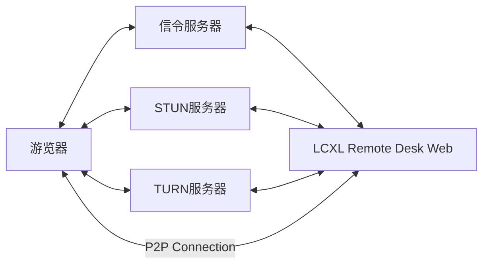
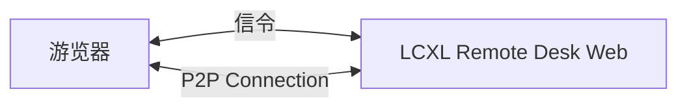

# LCXL Remote Desk Web——基于 Web 的远程桌面

[English](README.md)

LCXL Remote Desk Web 是一个基于 Web 技术的远程桌面解决方案，允许用户只通过浏览器访问和控制远程计算机。这个项目使用 WebRTC 技术来实现高效的视频流传输，后端使用 Rust 语言开发，前端则采用 React 框架。

> [!WARNING]
> **免责声明**：本项目目前处于**早期开发阶段**，代码库可能存在不稳定性、未修复的漏洞或功能不完整的情况。
> **安全风险提示**：远程桌面技术涉及对计算机系统的深度访问。在使用本项目进行远程连接时，请务必确保网络环境安全，并意识到潜在的安全风险（如未经授权的访问、数据泄露等）。作者不对因使用本项目而导致的任何形式的损害或损失承担法律责任。

## 文档导航

- 📖 [开发指南](DEVELOPMENT_CN.md) - 环境配置、开发流程、API 文档
- ⚙️ [配置说明](DEVELOPMENT_CN.md#开发配置详解) - 服务器配置参数
- 🚀 [快速开始](#快速开始) - 快速运行指南

## 网络架构图

LCXL Remote Desk Web 的网络架构图如下：



上面除了游览器以外有组件：

1. **信令服务器 (Signaling Server)**: 用于协调浏览器和远程桌面之间的连接，帮助建立 WebRTC 连接。
2. **STUN 服务器**: 用于获取网络地址信息，协助内网穿透。
3. **TURN 服务器**: 当 P2P 连接无法直接建立时，TURN 服务器作为中继服务器来传输数据。
4. **LCXL Remote Desk Web (server)**: 远程桌面的后端服务，使用 Rust 开发。

上面组件其实都集成在 LCXL Remote Desk Web 中。可以根据实际需求进行配置和扩展。

在远程桌面有公网IP或者在同一个局域网的情况下，浏览器可以直接与远程桌面建立 P2P 连接，不需要 STUN/TURN 服务器。在这种情况下，网络架构图如下：



## 功能描述

LCXL Remote Desk Web 提供了以下功能：

- **远程桌面访问**：用户可以通过浏览器访问远程计算机的桌面环境，无需安装额外的客户端软件。
- **文件传输**：支持在本地和远程计算机之间传输文件，方便用户进行文件管理操作。
- **终端控制**：提供命令行终端，用户可以直接在浏览器中执行命令，与远程计算机进行交互。

## 路线图 (Roadmap)

- [ ] **共享屏幕**: 将游览器窗口共享给其他用户，实现多人协作和屏幕共享。
- [ ] **摄像头控制**: 允许用户通过浏览器控制远程计算机的摄像头，实现视频监控或远程协助功能。
- [ ] **共享摄像头**: 支持多个用户同时观看同一个摄像头画面，方便团队协作和会议使用。

## 快速开始

### 运行服务器

1. **下载或克隆项目**

```bash
git clone <repository-url>
cd lcxl-remote-desk-web
```

1. **运行服务器**

```bash
cargo run --release
```

1. **访问 Web 界面**
打开浏览器访问：`http://localhost:8081`

如果是第一次使用，则会打开初始页面，输入管理员账号密码进行初始化。

## Docker 使用

本项目提供基于 Docker 的一键化部署方案。

### 使用 Docker Compose (推荐)

项目根目录提供了 `docker-compose.yml`，可以一键启动：

```bash
docker-compose up -d
```

启动后可通过 `docker-compose logs -f` 查看日志。

### 使用 Docker 运行

启动容器示例：

```bash
docker run -d \
  -p 8081:8081 \
  -v ./conf:/app/conf \
  -v ./logs:/app/logs \
  --name remote-desk \
  lcxl/lcxl-remote-desk-web:latest
```

> 💡 **提示**: 默认启动模式为 `signaling` (信令模式)。如需切换模式（例如 `default`），可通过命令行参数修改：
> `docker run ... lcxl/lcxl-remote-desk-web:latest ./lcxl-remote-desk-server --startup-mode default`

> 💡 **开发者提示**: 如需进行开发，请查看 [开发指南](DEVELOPMENT.md) 了解详细的环境配置和开发流程。

## 配置说明

项目支持通过 `conf/config.toml` 进行详细配置。

核心配置项包括：

- **系统设置**: 端口、监听地址、日志级别等。
- **用户设置**: 初始管理账号密码。
- **桌面设置**: 帧率、编码器、是否显示鼠标等。

> 📚 有关配置参数的完整列表和详细说明，请参考 [开发指南 - 配置详解](DEVELOPMENT_CN.md#开发配置详解)。

## 命令行参数

```bash
cargo run -- --help
```

可用参数：

- `-c, --config-file-path <PATH>`: 配置文件路径 (默认: conf/config)
- `-m, --startup-mode <MODE>`: 启动模式
  - `default`: 默认模式，包含信令和桌面服务器
  - `signaling`: 仅信令模式 (信令 + TURN)
  - `desk-server`: 仅桌面服务器

## 许可证

请参阅 LICENSE 文件了解详细信息。
