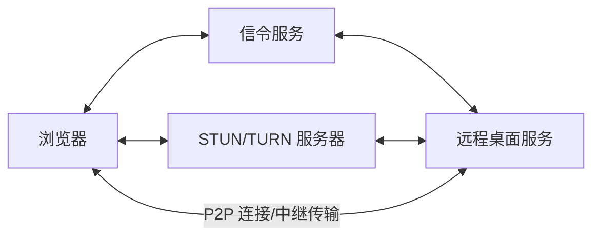

# LCXL Remote Desk Web —— 基于 WebRTC 的高效远程桌面

[English](README.md)

LCXL Remote Desk Web 是一个现代化的、基于 WebRTC 技术的远程桌面解决方案。它允许用户仅通过浏览器即可实现对远程计算机的高性能访问与控制，无需安装任何插件或客户端（管理端）。后端采用 Rust 编写，前端基于 React + Vite + Tailwind CSS 构建。

> [!WARNING]
> **免责声明**：本项目目前处于**早期开发阶段**，代码库可能存在不稳定性、未修复的漏洞或功能不完整的情况。
> **安全风险提示**：远程桌面技术涉及对计算机系统的深度访问。在使用本项目进行远程连接时，请务必确保网络环境安全。作者不对因使用本项目而导致的任何损害承担法律责任。

---

## ✨ 核心功能

- 🖥️ **高性能桌面连接**：基于 WebRTC 视频流，支持 AV1 (rav1e) / H.264 (x264 / OpenH264) / VP8 / VP9 软硬件编码，音频采用 Opus，极速低延迟。
- ⌨️ **功能完备的终端**：内置基于 xterm.js 的远程终端，完美支持 shell 交互。
- 📂 **文件管理系统**：支持文件的上传、下载、删除及**回收站**功能，轻松同步数据。
- 📋 **双向剪贴板**：支持文本剪贴板同步。
- 🎨 **远程白板**：允许在远端屏幕上进行标注与绘画，适合远程演示与协作（需 `tauri-app`）。
- 🔒 **隐私屏模式**：锁定本地显示器与输入，确保远程操作的私密性（需 `tauri-app`）。
- 🔊 **音频支持**：支持远程音频捕获与同步播放。
- 🌐 **多语言支持 (i18n)**：界面及文档支持中英文切换。

---

## 🚀 快速开始

### 方式 1：Docker 部署（推荐普通用户）

使用 Docker Compose 一键启动：

```bash
docker-compose up -d
```

启动后访问 `http://localhost:8081`，首次访问需设置管理员账号即可开始使用。

### 方式 2：Tauri 桌面客户端

适用于需要“隐私屏”“白板”等依赖本地显示的增强功能的场景：

```bash
cd tauri-app
cargo tauri dev
```

### 方式 3：源码运行（开发者）

1. **环境准备**：
   - 安装 [Rust](https://www.rust-lang.org/) (latest stable)
   - 安装 [Node.js](https://nodejs.org/)（前端使用 npm）
   - **AV1 编码支持（可选但推荐）**：使用 AV1 编码需要安装 [nasm](https://www.nasm.us/)。
     Windows 下安装示例：
     ```bash
     $NASM_VERSION="2.15.05" # or newer
     $LINK="https://www.nasm.us/pub/nasm/releasebuilds/$NASM_VERSION/win64"
     curl --ssl-no-revoke -LO "$LINK/nasm-$NASM_VERSION-win64.zip"
     7z e -y "nasm-$NASM_VERSION-win64.zip" -o "C:\nasm"
     # 为当前会话设置环境变量
     set PATH="%PATH%;C:\nasm"
     ```

2. **启动后端**（默认启用信令和桌面服务）：
   ```bash
   cargo run --release
   ```

3. **启动前端**：
   ```bash
   cd vite-project
   npm ci
   npm run dev
   ```
   访问 `http://localhost:5174`。

---

## ⚙️ 核心配置说明

项目通过 `conf/config.toml` 进行参数微调。部分关键配置：

- **系统设置**：监听地址、端口、日志级别等。
- **桌面 / 编码**：帧率、视频编码器（X264 / VP8 / VP9 / H264 / AV1）、是否显示光标等，可在连接发起时随会话设置下发。
- **模式切换**：`--startup-mode`（简写 `-s`）支持 `default`, `signaling`, `desk-server`, `service-daemon`, `session-worker` 多种工作模式；配置文件路径默认为 `conf/config.toml`（`-c` / `--config-file-path` 指定）。

> 📚 更多细节请参考 [开发指南 (DEVELOPMENT_CN.md)](DEVELOPMENT_CN.md)。

---

## 📡 工作原理



浏览器与远程桌面服务通过信令服务交换连接信息，随后借助 STUN/TURN 完成 NAT 穿透，尽可能建立 P2P 直连、必要时回退中继。信令服务器和 TURN 服务器已默认集成到 `server` 中，在公网或局域网环境下系统会自动尝试 P2P 直连。

---

## 🧩 项目结构

面向使用者，项目主要有三种形态：

- **`server`**：无界面的远程桌面服务端，内置信令与 TURN，适合服务器 / 命令行环境部署，支持完整、仅信令、仅被控端等多种启动模式。
- **`tauri-app`**：带界面的桌面增强版，在 `server` 基础上额外提供隐私屏、白板等需要本地显示的功能。
- **`vite-project`**：基于浏览器的 Web 前端，既是管理后台，也是远程连接的 Web 客户端。

> 其余为内部库（屏幕 / 音频采集与编码、输入注入、信令协议、IPC 通信等）。完整的模块划分与开发说明见 [开发指南 (DEVELOPMENT_CN.md)](DEVELOPMENT_CN.md)。

---

## 🗺️ 路线图 (Roadmap)

- [x] 基于 WebRTC 的高效桌面流
- [x] 跨平台支持 (Linux/Windows/MacOS)
- [x] 远程终端与文件管理
- [x] 隐私屏与白板功能
- [ ] 移动端访问界面优化
- [ ] 权限系统与多用户控制管理
- [ ] 录屏功能支持

---

## 📄 许可证

本项目采用 [Apache-2.0](LICENSE) 协议。
