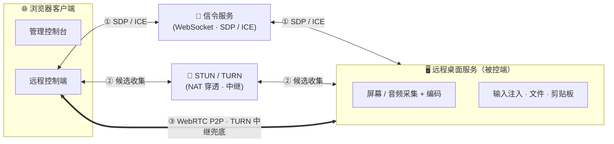
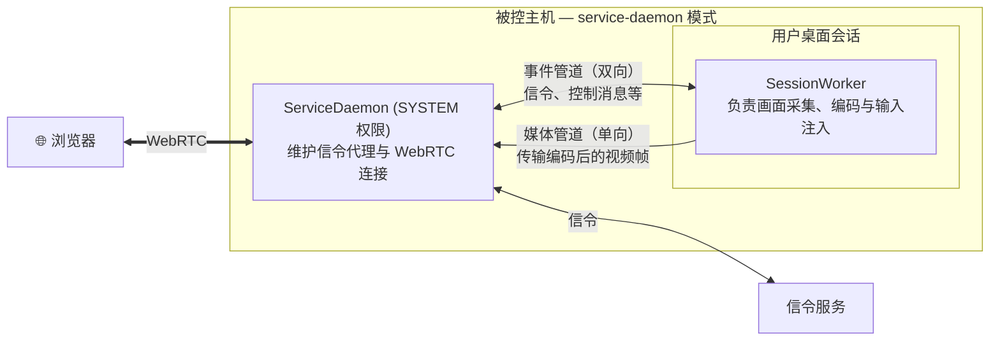
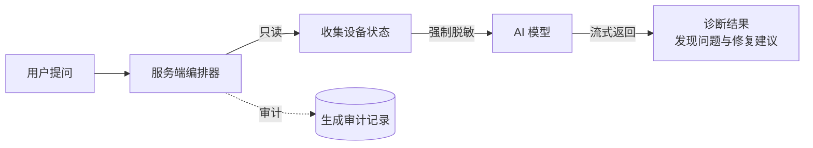

# LCXL Remote Desk Web

[English](README.md)

LCXL Remote Desk Web 是一款基于 WebRTC 的高性能远程桌面。除了基础的浏览器远程控制外，它还内置了系统诊断 AI，能够读取设备当前状态进行排障，并通过只读 [MCP](https://modelcontextprotocol.io/) 服务将这些能力开放给外部 AI 助手。项目对 AI 层的设计以安全为首要考量：服务端统一管理权限，模型默认仅提供操作建议，数据在上传前强制脱敏（脱敏失败会直接阻断请求），且每次调用均留存审计记录。后端采用 Rust 编写，前端基于 React + Vite + Tailwind CSS 构建。

> [!WARNING]
> **免责声明**：本项目目前处于早期开发阶段，代码库可能存在不稳定性、未修复的漏洞或功能不完整。
> **安全风险提示**：远程桌面技术涉及对计算机系统的深度访问。在使用本项目进行远程连接时，请务必确保网络环境安全。作者不对因使用本项目而导致的任何损害承担法律责任。

---

## 核心功能

- **AI 故障诊断**：通过自然语言提问，系统会自动采集设备状态（包括系统信息、进程、监听端口、服务、近期日志等），在本地脱敏后交由 AI 模型分析，并返回诊断结果与修复建议。目前兼容 OpenAI 和 Anthropic 的接口协议。
- **只读 MCP 服务**：通过 `--startup-mode mcp-stdio` 启动，可将设备的只读状态查询能力通过 MCP 协议暴露给本地的 AI 助手。提供的工具集为静态白名单，不包含任何可执行或具有写入权限的工具。
- **安全的权限控制**：服务端是判断授权的唯一依据。默认情况下 AI 只给出建议，高风险操作需人工确认。数据采集采用默认阻断的脱敏机制，API 密钥仅保留在服务端。
- **高性能桌面连接**：基于 WebRTC，支持 AV1 / H.264 / VP8 / VP9 的软硬件编码，音频采用 Opus 编码，保证极低延迟。
- **远程终端**：内置基于 xterm.js 的 Web 终端，支持完整的命令行交互。
- **文件管理**：支持文件的上传、下载、删除以及回收站功能。
- **剪贴板同步**：支持本地与远程的文本剪贴板双向同步。
- **远程白板**：允许在远端屏幕上进行标注与绘画，适合远程演示与协作（需配合 tauri-app 使用）。
- **隐私屏模式**：锁定本地显示器与输入，确保远程操作的私密性（需配合 tauri-app 使用）。
- **系统音频**：支持远程音频的捕获与同步播放。
- **多语言支持**：界面与文档提供中英双语。

---

## 快速开始

### 方式 1：Docker 部署（推荐）

使用 Docker Compose 一键启动：

```bash
docker-compose up -d
```

启动后访问 `http://localhost:8081`，首次访问需设置管理员账号。

### 方式 2：Tauri 桌面客户端

适用于需要隐私屏、远程白板等依赖本地系统能力的高级功能场景：

```bash
cd tauri-app
cargo tauri dev
```

### 方式 3：源码运行（面向开发者）

1. **环境准备**：
   - 安装 [Rust](https://www.rust-lang.org/) 最新稳定版。
   - 安装 [Node.js](https://nodejs.org/)。
   - **AV1 编码支持（可选）**：Windows 环境下使用 AV1 需要安装 [nasm](https://www.nasm.us/)：
     ```bash
     $NASM_VERSION="2.15.05"
     $LINK="https://www.nasm.us/pub/nasm/releasebuilds/$NASM_VERSION/win64"
     curl --ssl-no-revoke -LO "$LINK/nasm-$NASM_VERSION-win64.zip"
     7z e -y "nasm-$NASM_VERSION-win64.zip" -o "C:\nasm"
     set PATH="%PATH%;C:\nasm"
     ```

2. **启动后端**（默认开启信令与桌面服务）：
   ```bash
   cargo run --release
   ```

3. **启动前端**：
   ```bash
   cd vite-project
   npm ci
   npm run dev
   ```
   启动后访问 `http://localhost:5174`。

---

## 核心配置说明

项目的详细参数可通过 `conf/config.toml` 进行调整：

- **系统设置**：包括监听地址、端口、日志级别等。
- **桌面与编码**：帧率、视频编码器（X264 / VP8 / VP9 / H264 / AV1）、光标可见性等，可在建立连接时针对每个会话进行设置。
- **AI 模型配置**：在管理控制台设置服务商、接口地址、模型名称与 API 密钥。密钥仅存放在服务端，不会泄露给浏览器或写入日志。
- **运行模式**：通过 `--startup-mode`（或 `-s`）切换启动模式，支持 default、signaling、desk-server、service-daemon 等多种模式；配置文件路径可通过 `-c` 参数指定。

> 更多技术细节请参考 [开发指南 (DEVELOPMENT_CN.md)](DEVELOPMENT_CN.md)。

---

## 工作原理

### 连接与媒体链路



浏览器与被控端首先通过信令服务交换 SDP 和 ICE 数据，并借助 STUN/TURN 服务收集候选地址，优先建立直连的 WebRTC P2P 连接。仅在内网穿透失败时，才会回退到 TURN 中继。服务端已内置信令与 TURN 服务，方便进行局域网和公网部署。

连接建立后，所有数据均在该链路上进行传输。这包括视频轨道、音频轨道，以及专门用于鼠标、键盘、文件传输、剪贴板和白板的数据通道。远程终端则会使用独立的数据通道。

### 进程模型

`server` 支持多种启动模式。默认的 default 模式将画面采集、编码、输入控制等流程在单进程中运行。为了能够捕获 Windows 的登录和授权界面（如 UAC 弹窗），可以通过 service-daemon 模式将进程权限拆开：



ServiceDaemon 运行在系统权限下，负责维护网络连接和子进程生命周期。当用户进行交互时，它会在桌面会话内启动 SessionWorker 来执行实际的画面抓取和输入模拟。它们之间通过两条管道进行通信，这种隔离设计使得在切换系统用户时，画面采集进程可以安全重启而不至于断开浏览器的连接。

---

## AI 诊断架构

除了基础的远程操作，系统还允许 AI 分析设备的运行状态，协助排查问题。

**客户端内的 AI 诊断**。当用户在网页端提出疑问（如：“这台机器为什么卡顿？”）时，服务端会执行一套固定的处理流程：采集状态、脱敏、调用模型、返回诊断结果。



- **状态采集**：获取系统信息、进程列表、网络端口、服务状态、日志以及屏幕截图。
- **协议兼容**：内部抽象层屏蔽了具体协议差异，可随意切换 OpenAI 兼容接口或 Anthropic 网关。
- **安全约束**：模型生成的修复命令仅作为建议展示，遇到敏感操作必须经过用户显式确认。
- **部署方式**：诊断逻辑封装在 `desk-diagnose-core` 中，被控端既可以自行完成完整的诊断流程，也可以只作为数据采集端，将脱敏后的数据发往中心服务器进行处理。这种方式适合大规模部署，可以避免每台被控端都保存 API 密钥。

**面向外部的 MCP 服务**。如果使用 `--startup-mode mcp-stdio` 启动程序，设备将作为本地的 MCP 服务运行。它会向本地的其他 AI 助手提供一组只读工具，包括查询系统信息、进程和日志等。为保障安全，该模式去除了屏幕截图工具以及所有具有执行权限的指令。

**安全机制**。权限范围和审批逻辑均在服务端进行硬性校验，客户端无法伪造。任何敏感数据的采集都会经过严格脱敏，一旦脱敏环节出错将立刻阻断请求。此外，所有的模型调用都会生成审计记录，但为了隐私考量，仅记录调用量和内容大小，绝不保存原始的提问与模型回复。

---

## 项目结构

对于最终用户，项目提供三种形式的产物：

- **`server`**：无界面的远程桌面服务端，内置信令与 TURN 服务。适合在服务器和纯命令行环境中部署。
- **`tauri-app`**：带图形界面的桌面增强版。在基础服务端之外，额外提供隐私屏、白板等需要接管本地显示输出的功能。
- **`vite-project`**：基于 React 编写的 Web 前端，既作为管理后台，也是远程连接的控制端。

> 其余部分为内部的逻辑库，包含画面捕捉、音频处理、输入模拟和网络通信等模块。详细的开发指引请查阅 [开发指南 (DEVELOPMENT_CN.md)](DEVELOPMENT_CN.md)。

---

## 路线图 (Roadmap)

- [x] 基于 WebRTC 的高性能桌面流传输
- [x] 跨平台支持 (Linux/Windows/MacOS)
- [x] 远程终端与文件管理系统
- [x] 隐私屏与白板功能
- [x] AI 系统故障诊断（支持 OpenAI 与 Anthropic 协议）
- [x] 提供给外部 AI 助手的 MCP 只读服务
- [ ] 具备安全拦截机制的 AI 命令执行功能
- [ ] 移动端浏览体验优化
- [ ] 基于角色的权限系统与多用户控制管理
- [ ] 远程会话录制功能

---

## 许可证

本项目采用 [Apache-2.0](LICENSE) 协议。
