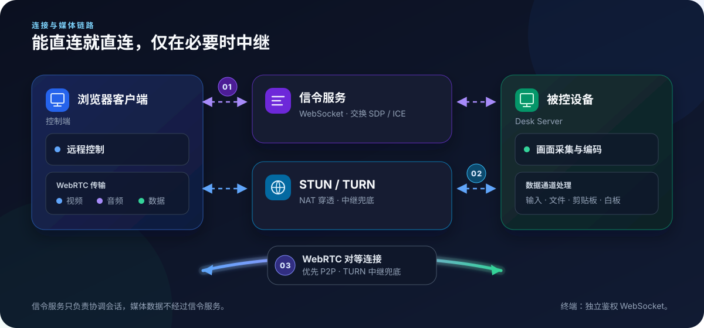
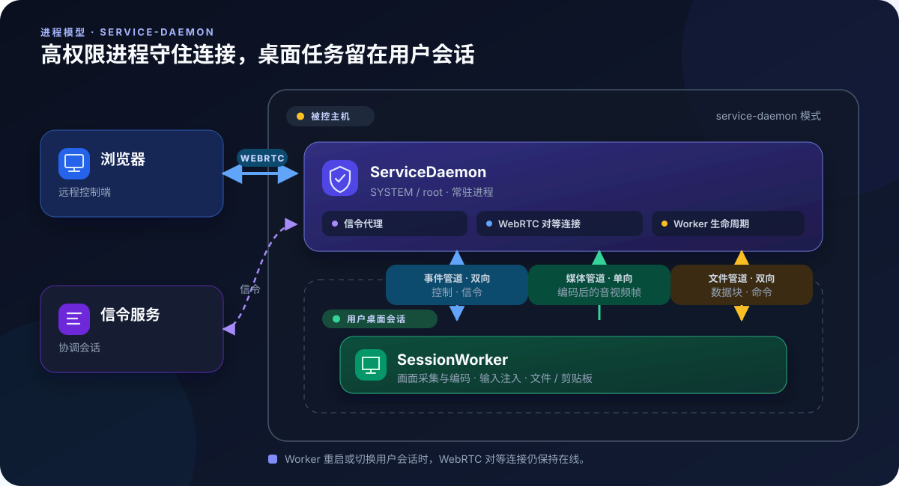
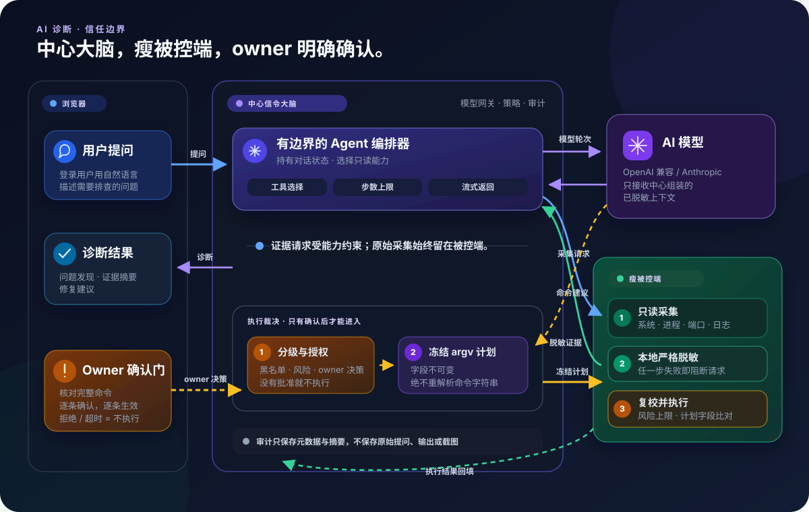

# LCXL Remote Desk Web

[English](README.md)

> [!WARNING]
> 
> **免责声明**：本项目目前处于早期开发阶段，代码库可能存在不稳定性、未修复的问题或功能不完整。
> 
> **安全风险提示**：本项目禁止在任何非法场景下使用，作者不对因使用本项目而导致的任何损害承担责任。

LCXL Remote Desk Web 是一款 **AI 原生（AI-Native）**的开源高性能远程桌面。

* 原生基于 WebRTC 技术，不需要下载单独的控制端，只需要有现代游览器就能拥有原生的远程桌面的体验；
* 被控端原生支持 Windows，MacOS 和 Linux，支持 4K @ 60 Hz 屏幕采集和输出；
* 原生支持 AI 接入，可以通过 AI 快速帮你分析和解决问题；
* 后端采用 Rust，前端基于 React、Vite 和 Tailwind CSS。

---

## 核心功能

- **能力分级的访问码**：可为设备访问码分别设置远程控制、文件浏览/传输/删除、终端、剪贴板、隐私屏与白板的能力上限；被控端全局策略与实时确认仍会继续生效。
- **高性能桌面连接**：基于 WebRTC，支持 X264 / OpenH264 / VP8 / VP9 / AV1 视频编码与 Opus 音频编码。
- **远程终端**：内置 xterm.js，通过独立且经过身份认证的 WebSocket 提供完整的命令行交互。
- **文件管理**：支持上传、下载、删除及回收站流程。
- **剪贴板同步**：支持文本剪贴板双向同步（需 HTTPS 环境）。
- **远程白板**：在远端屏幕上标注与绘画（需配合 `tauri-app`）。
- **隐私屏模式**：远程操作期间锁定本地显示与输入（需配合 `tauri-app`）。
- **Windows 虚拟屏（实验性）**：在 Windows `service-daemon` 模式下提供 IddCx 虚拟显示器、自适应分辨率和可选独占模式。
- **跨平台采集**：Windows WASAPI、Linux PipeWire、macOS ScreenCaptureKit 系统音频链路，以及 Windows、Linux、macOS 的桌面采集与输入支持。
- **AI 诊断**：用户可以直接用自然语言提问。AI 通过调用本项目所提供的接口自主的收集信息和分析问题，如果开启了执行权限，还可以让用户通过确认的方式来运行命令，支持 OpenAI 兼容接口和 Anthropic API。
- **由设备所有者确认命令执行**：特别提示一点，模型只能提出命令建议，不能自行执行。服务端会完成风险分级，并直接拒绝命中黑名单的命令；设备所有者确认完整命令后，服务端固化执行计划，被控端再次核对各项参数和风险上限，确认无误后执行，并将结果返回诊断流程、写入审计记录。
- **只读 MCP 服务（实验性）**：`--startup-mode mcp-stdio` 仅提供系统信息、进程、监听端口和受策略控制的近期日志四个静态白名单工具，不调用模型，也没有截图、执行、控制或写入能力。
- **多语言支持**：界面与文档提供中英双语。

> 各项能力的详细说明与操作步骤请参考文档站：[远程控制与串流](docs/zh/features/streaming.md)、[终端、文件与剪贴板](docs/zh/features/terminal-files-clipboard.md)、[防窥屏与白板](docs/zh/features/privacy-whiteboard.md)、[虚拟显示器](docs/zh/features/virtual-display.md)、[访问码](docs/zh/guide/access-codes.md)、[AI 诊断](docs/zh/features/ai-diagnostics.md)、[MCP 服务](docs/zh/features/mcp-server.md)。

---

## 快速开始

### 方式 1：下载被控端直接运行

**被控机在局域网内、或本身有公网 IP 时，这是最佳方式**——被控端自带信令、STUN / TURN 与 Web 控制台，不需要任何额外服务器，浏览器直连即可。

1. 从 [Releases 页面](https://github.com/lcxl/lcxl-remote-desk-web/releases)下载对应平台的被控端压缩包：

   | 平台 | 压缩包 |
   |---|---|
   | Windows x86_64 | `windows-x86_64-server.zip` |
   | Linux x86_64 | `linux-x86_64-server.tar.gz` |
   | macOS Apple Silicon | `macos-aarch64-server.tar.gz` |
   | macOS Intel | `macos-x86_64-server.tar.gz` |

2. 解压后目录里是可执行文件与同级的 `static/`（Web 控制台静态资源），**两者必须保持同级**。直接运行即可，默认就是 `default` 模式（内置信令 + 被控端流水线）：

   ```bash
   ./lcxl-remote-desk-server          # Windows 为 lcxl-remote-desk-server.exe
   ```

3. 浏览器访问 `http://<被控机地址>:8081`，按向导创建管理员账号并设置入站安全策略，随后即可从同一局域网（或可直连该公网 IP 的任意网络）远程控制这台设备。

> **没有公网 IP，但被控机能访问公网？**
> 可以在初始化向导的连接步骤（或之后的**出站连接**设置页）把 **Manager 域名**填成公共服务器 `lcxbox.app`，并粘贴在其控制台创建的 API 令牌，由它完成信令与 NAT 穿透，控制端随后从 `https://lcxbox.app` 访问该设备。
>
> 该公共服务器目前部署在美国，**非美国地区访问可能较慢甚至连不通**；对时延敏感或访问不畅时，请改用下面的方式 2 自建信令服务器。

### 方式 2：自建信令服务器

被控机没有公网 IP，又希望链路完全自主可控时使用：向云服务商购买一台有公网 IP 的 VPS，在上面跑信令服务，被控端把信令地址指向它。

1. 在 VPS 上克隆仓库并用 Docker Compose 拉起服务。镜像默认以 `signaling` 模式启动，承载 Web 控制台、信令与可选 TURN 中继；桌面采集和输入注入仍由容器外的被控设备完成：

   ```bash
   git clone https://github.com/lcxl/lcxl-remote-desk-web.git
   cd lcxl-remote-desk-web
   printf 'LRD_BOOTSTRAP_TOKEN=%s\n' "$(openssl rand -hex 32)" > .env
   docker compose up -d
   ```

2. 访问 `http://<VPS 地址>:8081`，创建管理员账号并填写 `.env` 中保存的令牌。请长期保留该值：服务器初始化完成后令牌不再授权任何操作，但 Compose 每次启动时仍会校验这个必填变量。

3. 公网部署请在反向代理上终结 TLS（并放行信令的 WebSocket `Upgrade`）。若需要本机中继，按 [config.toml 参考](docs/zh/config/config-toml.md)在 **TURN 设置**页配置 `[[turn.interfaces]]` 的 `listen` / `external` 地址，在 `docker-compose.yml` 中放开中继端口范围的映射，并在安全组一并放行（默认 `50000-50050/udp`）。

4. 在信令服务器控制台的**信令接入令牌**页复制令牌；被控端仍按方式 1 下载运行，然后在它的**出站连接**设置页把**信令服务器地址**填成 `wss://<你的域名>/api/desk/signaling`（未配 TLS 的内网可用 `ws://<VPS 地址>:8081/api/desk/signaling`），令牌填刚才复制的值。

> 出于安全考虑，被控端默认拒绝以明文 `ws://` 连接**公网**信令地址（`require_secure_signaling`）；回环与内网 / 局域网地址不受此限制。

### 方式 3：源码运行

1. 安装仓库钉定的 Rust 1.90 工具链、Node.js 22.16+，以及[开发指南](DEVELOPMENT_CN.md)列出的平台依赖。

2. **先启动前端。**Debug 构建的桌面外壳会加载 Vite 开发服务器，前端没起来会白屏：

   ```bash
   cd vite-project
   npm ci
   npm run dev
   ```

   开发服务器监听 `http://localhost:5174`。

3. 前端就绪后，在另一个终端启动带 Tauri 界面的被控端（内嵌完整服务端，隐私屏、远程白板等本地 GUI 集成只在这个外壳里可用）：

   ```bash
   cargo run -p lcxl-remote-desk-tauri
   ```

   如果只需要纯后端而不要 GUI 外壳，改跑 `cargo run -p lcxl-remote-desk-server`（默认 `default` 模式），然后在浏览器访问 `http://localhost:5174`。

> 三种方式的完整步骤、前置条件与下一步指引请参考[快速开始](docs/zh/guide/quick-start.md)；公网加固、系统依赖、容器持久化目录与 `LRD_*` 环境变量请参考[部署](docs/zh/guide/deployment.md)。

---

## 核心配置说明

被控端配置保存在与启动模式无关的**平台标准路径**——portable、desk-server、service-daemon、MCP 与本地访问命令共用同一份 profile：

| 平台 | 配置文件 | 日志目录 |
|---|---|---|
| Windows | `%ProgramData%\LCXL Remote Desktop\config\config.toml` | `%ProgramData%\LCXL Remote Desktop\logs` |
| Linux（root） | `/etc/lcxl-remote-desk/config.toml` | `/var/log/lcxl-remote-desk` |
| Linux（普通用户） | `$XDG_CONFIG_HOME/lcxl-remote-desk/config.toml`（未设置时为 `~/.config/lcxl-remote-desk/config.toml`） | `$XDG_STATE_HOME/lcxl-remote-desk/logs`（未设置时为 `~/.local/state/lcxl-remote-desk/logs`） |
| macOS | `~/Library/Application Support/com.lcxl.remote-desk/config/config.toml` | `~/Library/Logs/lcxl-remote-desk` |

用 `-c, --config-file-path <PATH>` 可显式切换到其他 profile，数据库、运行时套接字等同级文件会跟随该路径；部分设置也可用 `LRD_*` 环境变量覆盖。文件不存在时按默认值自动生成：监听 `0.0.0.0` / `::` 的 `8081` 端口、启用 IPv6、信令与 Manager 地址为空（即只用内置信令）、默认拒绝以明文连接公网信令；内置 TURN 开关默认打开，但要等配置了 `[[turn.interfaces]]` 才会真正提供中继。完整字段见 [config.toml 参考](docs/zh/config/config-toml.md)。

以下主机侧设置可在本地控制台保存：

- **系统与连接**：监听地址和端口、本地与远程信令、Manager 连接、日志和内置 TURN 接口。
- **桌面与编码**：显示器、帧率、编码器、光标、音频及每会话媒体参数。
- **主机安全策略**：各项能力的允许 / 拒绝 / 询问策略、采集策略（`allow_logs`、`allow_screen`），以及本机允许的 AI 执行风险上限。
- **Windows 虚拟屏**：`service-daemon` 模式下的驱动状态、启用开关、独占模式与自适应分辨率参数。

模型配置与主机配置分离：服务商、接口地址、模型名称和只写 API 密钥由中心信令服务的控制台管理。浏览器和被控端都不会拿到模型凭据。

`--startup-mode` 支持 `default`、`signaling`、`desk-server`、`service-daemon`、`session-worker` 和 `mcp-stdio`。其中 `session-worker` 是由守护进程启动的内部工作进程。

> 逐字段的配置说明请参考 [config.toml 参考](docs/zh/config/config-toml.md)，全部命令行参数请参考 [CLI 参数](docs/zh/config/cli.md)，各启动模式的进程布局请参考[启动模式](docs/zh/guide/startup-modes.md)；构建依赖见[开发指南](DEVELOPMENT_CN.md)。

---

## 工作原理

### 连接与媒体链路



浏览器与被控端通过信令服务交换 SDP / ICE，并借助 STUN/TURN 收集候选地址。连接会优先使用 WebRTC P2P 直连，仅在 NAT 穿透失败时回退到 TURN。内置 TURN 只有在配置监听/公网接口后才会提供中继，部署时还需放行相应的中继端口。

连接建立后，WebRTC 承载视频、Opus 音频，以及输入、剪贴板、文件传输和白板事件的数据通道。远程终端**不复用**这些数据通道，而是建立一条独立且经过鉴权的 WebSocket。

### 进程模型

所有被控模式都使用同一套“守护进程 → WebRTC 对等连接管理器 → 会话工作进程”流水线。`default` 和 `desk-server` 在单个进程内运行这些组件，并通过进程内通道通信；`service-daemon` 则将它们拆分到不同系统进程，使桌面任务能够在当前用户的桌面会话中运行：



常驻的 ServiceDaemon 负责信令、WebRTC 对等连接以及工作进程的生命周期；SessionWorker 在桌面会话内负责采集、编码、系统音频、输入注入、剪贴板和文件操作。两者使用三条 IPC 通道：双向事件管道、从工作进程指向守护进程的单向音视频管道，以及双向文件传输管道。切换用户会话时可以重启工作进程，而浏览器侧的 WebRTC 连接仍然保持在线。

目前只有 Windows 接入了真正的系统服务管理；其他平台运行 `service-daemon` 时会退化为交互式进程。

> 完整的组件划分与数据流请参考[架构](docs/zh/reference/architecture.md)，术语与角色关系请参考[核心概念](docs/zh/guide/concepts.md)，逐模式的进程布局请参考[启动模式](docs/zh/guide/startup-modes.md)，信令帧定义请参考[信令协议](docs/zh/reference/signaling-protocol.md)。

---

## AI 诊断架构

AI 推理由中心服务统一编排，被控设备只负责证据采集和最终执行。`default` 模式内置中心信令服务，因此便携版可以独立完成诊断；单独运行的 `desk-server` 则需要连接外部信令服务或 Manager 才能使用 AI 编排。



- **有明确边界的智能体循环**：中心编排器按需选择采集能力、请求证据并调用模型，可以在配置的推理轮次和工具重复调用上限内连续分析问题。
- **被控端采集与脱敏**：按需采集系统信息、进程、监听端口、服务、日志和可选截图。日志与截图受本地策略控制；每条证据都在被控端严格脱敏，任一步失败即阻断请求。
- **服务端模型访问**：支持 OpenAI 兼容接口与 Anthropic 协议。API 密钥只保存在中心服务，不会发送给浏览器或被控设备。
- **默认只提出建议**：命令建议使用独立的授权流程，必须通过风险检查和黑名单检查，并由设备所有者逐条确认；服务端会固化获批的命令与参数，被控端再次核对不可变字段和风险上限后才会执行。
- **保护隐私的审计**：模型调用、批准/拒绝、脱敏失败和执行结果会产生审计元数据与摘要；审计事件不保存原始提问、模型回复、stdout 或截图。

**面向外部的 MCP 服务。** `mcp-stdio` 与内置诊断助手完全分离，只提供 `lcxl_system_info`、`lcxl_process_list`、`lcxl_network_ports` 和 `lcxl_recent_logs`。其中日志工具每次调用都会实时检查 `allow_logs`；MCP 不调用模型，也不提供截图、命令执行、远程控制或其他写入工具。

> 模型服务商配置与实际使用步骤请参考 [AI 诊断](docs/zh/features/ai-diagnostics.md)，信任边界、脱敏与审计的完整约束请参考 [AI 安全模型](docs/zh/security/ai-security-model.md)，外部助手接入方式请参考 [MCP 服务](docs/zh/features/mcp-server.md)。

---

## 项目结构

- **`server`**：多模式 Rust 可执行程序，可作为便携一体版、信令与控制服务、被控端、Windows 系统服务、内部工作进程或只读 MCP stdio 服务运行。
- **`signal`**：信令、访问授权、中心 AI 编排/模型网关、执行裁决与审计持久化。
- **`diagnose-core` / `agent-protocol`**：与具体模型无关的共享智能体逻辑，以及强类型的证据和执行协议。
- **`capture-engine` / `input` / `ipc-protocol`**：采集编码、输入注入，以及守护进程与工作进程之间的通信。
- **`tauri-app`**：桌面 GUI 外壳，以及隐私屏、白板等本地集成。
- **`vite-project`**：React Web 控制台与浏览器远程控制端。

> 各模块的职责边界与依赖关系请参考[模块地图](docs/zh/reference/modules.md)，REST 接口请参考 [REST API](docs/zh/reference/api.md)，构建与平台细节请查阅[开发指南](DEVELOPMENT_CN.md)。

---

## 路线图

- [x] 基于 WebRTC 的高性能桌面流传输
- [x] 跨平台支持（Linux / Windows / macOS）
- [x] 远程终端与文件管理
- [x] 能力分级的设备访问码
- [x] 隐私屏与白板
- [x] Windows service-daemon 虚拟屏
- [x] 中心化 AI 故障诊断（OpenAI 兼容 / Anthropic）
- [x] 面向外部 AI 助手的只读 MCP 服务
- [x] 设备所有者逐条确认、服务端固化计划、被控端再次核验的 AI 命令执行
- [ ] 移动端浏览体验优化
- [ ] 远程会话录制

---

## 许可证

本项目采用 [Apache-2.0](LICENSE) 协议。
