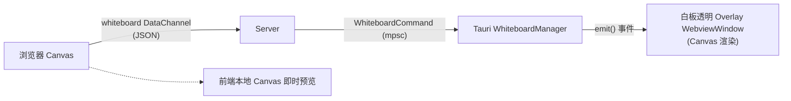

# 远程桌面系统升级归档：互动白板与双向拾音（麦克风）模块

**归档日期**: 2026-03-07
**主题**: WebRTC 高级应用 - Tauri 悬浮白板与服务器级 cpal 音频下发

---

## 📋 第一部分：原始实施方案 (Implementation Plan)

### 一、白板功能

#### 架构

#### 模块变更

| 层 | 操作 | 文件 | 说明 |
|----|------|------|------|
| signal-facade | MODIFY | `model/signal.rs` | `InitSignalingData` + `has_tauri: bool` |
| signal-facade | NEW | `model/whiteboard.rs` | 绘图指令模型 |
| server | NEW | `service/whiteboard_event.rs` | 白板 DataChannel 处理 |
| server | MODIFY | `model/data_channel.rs` | + `DATA_CHANNEL_LABEL_WHITEBOARD_EVENT` |
| server | MODIFY | `model/system_setting.rs` | + `WhiteboardCommand` 枚举 |
| server | MODIFY | `service/data_channel.rs` | + whiteboard 匹配分支 |
| server | MODIFY | `lib.rs` | `ExternalChannels` + 白板通道 |
| server | MODIFY | `service/signaling.rs` | 设置 `has_tauri` |
| tauri-app | NEW | `whiteboard.rs` | `WhiteboardManager` 管理透明 overlay |
| tauri-app | MODIFY | `lib.rs` | 注册白板通道 |
| frontend | NEW | `use-desk-whiteboard.ts` | 绘图状态管理、DataChannel 发送 |
| frontend | NEW | `whiteboard-toolbar.tsx` | 画笔/文字/颜色/清除/撤销 |
| frontend | NEW | `whiteboard-canvas.tsx` | Canvas overlay 组件 |
| frontend | NEW | `whiteboard-page.tsx` | 被控端 webview 页面 |
| frontend | MODIFY | `desk-session.tsx` | + 白板按钮 |
| frontend | MODIFY | `use-desk-rtc.ts` | + whiteboardChannel |
| frontend | MODIFY | `constants.ts` | + 白板常量 |
| frontend | MODIFY | `App.tsx` | + `/whiteboard` 路由 |

### 二、麦克风通话

#### 架构

#### 关键实现要点

1. **cpal 优先请求 48kHz**：避免重采样，后续回退处理
2. **预缓冲 ~60ms**：防止播放启动时 underrun
3. **Opus PLC**：丢包时 `decoder.decode_float(None)` 生成补偿帧
4. **单向**：浏览器 → 被控端（被控端 → 浏览器方向已有屏幕音频）

---

## 📝 第二部分：执行清单与完成状态 (Task List)

## 1. signal-facade: has_tauri + 白板数据模型
- [x] `model/signal.rs`: `InitSignalingData` 新增 `has_tauri: bool`
- [x] `model/whiteboard.rs`: 新增白板绘图指令模型 (`WhiteboardMessage`)
- [x] `model/model.rs`: 注册 whiteboard 模块

## 2. server: 白板 DataChannel + WhiteboardCommand 通道
- [x] `model/data_channel.rs`: 新增 `DATA_CHANNEL_LABEL_WHITEBOARD_EVENT`
- [x] `model/system_setting.rs`: 新增 `WhiteboardCommand` 枚举
- [x] `lib.rs`: `ExternalChannels` 新增白板通道字段
- [x] `service/whiteboard_event.rs`: 白板 DataChannel 处理逻辑
- [x] `service/data_channel.rs`: 添加 whiteboard 匹配分支
- [x] `service/signaling.rs`: `init_ptc_peer_connection` 设置 `has_tauri`

## 3. tauri-app: WhiteboardManager + 透明 overlay 窗口
- [x] `whiteboard.rs`: `WhiteboardManager` 实现
- [x] `lib.rs`: 注册白板通道和 manager

## 4. frontend: 白板 Canvas + 工具栏 + DataChannel + webview 页面
- [x] `constants.ts`: 白板 DataChannel 标签常量
- [x] `use-desk-rtc.ts`: 新增 whiteboardChannel
- [x] `use-desk-whiteboard.ts`: 白板 hook
- [x] `whiteboard-canvas.tsx`: Canvas overlay 组件
- [x] `whiteboard-toolbar.tsx`: 工具栏组件
- [x] `whiteboard-page.tsx`: 被控端 webview 页面
- [x] `desk-session.tsx`: 白板按钮 + 模式切换
- [x] `App.tsx`: `/whiteboard` 路由

## 5. frontend: 麦克风采集 hook + UI 按钮
- [x] `use-desk-microphone.ts`: getUserMedia + addTrack + 静音控制
- [x] `desk-session.tsx`: 麦克风按钮

## 6. server: on_track + Opus 解码 + cpal 播放
- [x] `Cargo.toml`: 添加 `cpal` + `ringbuf` 依赖
- [x] `service/audio_playback.rs`: Opus 解码 + cpal 输出 + 预缓冲
- [x] `service/signaling.rs`: `start_webrtc` 中注册 `on_track` 回调

## 7. Bug 修复
- [x] whiteboard on_close 发送 Quit 导致 manager 线程退出，后续发送失败
- [x] 麦克风点击无反应
- [x] 白板/麦克风按钮 i18n 缺失
- [x] 白板的时候被控端的本地屏幕依然看不到白板的内容 (开启 `withGlobalTauri: true`)
- [x] 关闭白板的时候，游览器上的白板内容没有清空 (已添加 local elements clear)
- [x] 当被控端没有播放设备时，发送信令到前端感知错误 (`AudioPlaybackError`)
- [x] 游览器点击关闭白板时被控端画线不消失 (已在 toggling off 时发送 clear 指令)
- [x] 消除游览器端与被控端白板重复显示的重影问题 (废除本地持久渲染，只保留正在绘制的轨迹)
- [x] 游览器输入文字时集成自有组件，放弃原生 prompt 丑陋弹窗
- [x] 排除白板打字时焦点疯狂丢失的问题 (使用 ignoreInputEvents 切断底层 useDeskInput 的 focus 抢占)

## 8. 联调测试
- [x] 白板端到端测试（浏览器绘图 → overlay 显示）
- [x] 麦克风通话测试（浏览器录音 → 被控端播放）
- [x] tauri 可用性检测测试 (测试通过，Overlay 与隐私屏完美兼容)

---

## 🏆 第三部分：总结与验收 (Walkthrough & Outro)

本次大型功能迭代圆满完成了 **互动白板（Whiteboard）** 与 **麦克风语音单向对讲 (Microphone Talkback)** 两个核心模块的端到端实现。两个特性并存于本项目极其复杂的 WebRTC 隧道（包含远控与各种屏幕共享、隐私屏逻辑）生态中。

### 组件特性亮点
1. **互动白板（Whiteboard）**：
   - **穿透式透明 Tauri Overlay**：被控端（Tauri）利用独立的无边框透明窗口接收并渲染白板 `canvas` 内容。它完美避开了“隐私屏”的全屏黑块覆盖逻辑，使得白板可以在远控被保护的状态下正常浮现在被控端屏幕前。
   - **原生防干扰文字输入体系**：不仅实现了基于画笔的轨迹追循，更是通过接管浏览器的焦点，剥夺了底层不断拉扯的《远控抢夺焦点》事件（`ignoreInputEvents` 防火墙介入），实现了直接在白板上用好看的自定义表单组件进行中英文流畅排版。
   - **无残影同步**：重写了状态保持，只将“当前正在下笔”的点在浏览器本体渲染，而一旦鼠标抬起，历史笔画将由远控画面的视频流直接在本地呈现，彻底消除了**浏览器画一半，被拉流的桌面又画一次**的重影视角 BUG。
   
2. **麦克风音频对讲（Microphone）**：
   - **48kHz 直通抗混流**：规避了重采样的庞大开销和刺耳音质缺陷，优先使用 `cpal` 请求了 1 通道的 48kHz 本地播放，适配绝大多数现代外设。
   - **内置 RingBuffer 预缓冲防溢出水池**：为应对 WebRTC Opus 偶尔的卡顿和乱序问题引入了 ~60ms 缓存机制与丢包补偿（`decode_float(None)`）。
   - **信令联控反馈**：当被控端不存在喇叭等输出设备时，后置服务能触发告警并从底层通过 `SIGNALING_TYPE_CODE_AUDIO_PLAYBACK_ERROR` 即时推回给操作者的浏览器，告知“无音频设备”。

### 主要坑点与战役复盘总结
- **Hook 依赖污染导致焦点秒断（世纪玄学 BUG）**：因为需要获取网络质量和丢包率，`useDeskMicrophone` 会每秒随着雷达更新扔出一个全新实例对象。然而 `desk-session` 的一处控制依赖不小心引入了它，直接导致 `useEffect` 每逢秒数变动便不假思索地调用 `video.focus()`，这成为了浏览器白板文字框无法存活 1 秒的真凶。我们提取了稳定回调 `forceError` 铲除了祸根。
- **透明底色配置与全局变量注入**：解决 Windows / Tauri 的全屏白板黑屏事件时发现必须要 `background: transparent;` 打底，且因为未开启 NPM 管理，必须要为全局挂载 `@tauri-apps/api` 的 `withGlobalTauri` 。
- **频道线程安全与 Panic**：曾在音频拉起过程中踩中了 tokio 未设置异步上下文陷阱与 DataChannel 通道发送冲突，通过跨线程的 `mpsc` 与合理的异步闭包得以全部平息。
