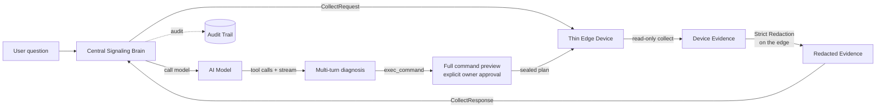

# AI Diagnostics

In addition to manual control, LCXL Remote Desk lets AI models **read and analyze** device state and, when the authenticated owner explicitly approves a command, act on the diagnosis.

::: info Under a shared access code
When you connect by an [access code](/guide/access-codes) rather than as the owner, the session is capability-scoped. It never receives owner free-form command admission; non-owner and shared-access execution remains template-constrained or disabled.
:::

## How It Works

AI is orchestrated by the **central signaling server** (the "central brain"); the device is a **thin edge** that only provides read-only evidence on request. When a user asks a question during a session (e.g. *"Why is this system slow?"*), the central server drives a strict pipeline:

1. The central brain requests **read-only evidence** from the edge (system info, processes, ports, logs, screenshots).
2. The edge **collects and redacts** the evidence locally — redaction **fails closed**, and raw screenshot bytes are stripped before anything leaves the host.
3. The central brain **calls the model** (only after the edge's redaction succeeds).
4. The central brain runs a multi-turn tool loop and streams the answer back to the browser.
5. If the model requests `exec_command`, the loop parks. The browser shows the complete shell, command, working directory, timeout, and server-authoritative risk; only an explicit approval resumes dispatch.

## Key Properties

- **Thin Edge** — the device never runs model inference or holds provider credentials; it only collects and redacts evidence when the central brain asks.
- **Read-Only Data Collection** — system info, processes, ports, logs, and screenshots, gated locally by the edge collection policy.
- **Model Agnostic** — compatible with both OpenAI-compatible and Anthropic endpoints, configured centrally.
- **Suggest-Only Defaults** — the model proposes fixes; execution requires explicit user confirmation, capped by each device's local execution ceiling.
- **Owner-Confirmed Actions** — in Confirm Each Action / Session Approved mode, the authenticated owner may approve an off-template PowerShell, pwsh, bash, or sh command. It is always shown as **Critical** and only the effective blocklist is claimed to have been checked.
- **No Autonomous Approval** — the model may request a command, but it cannot approve its own request. Fleet, automation, MCP, shared-access, and non-owner paths remain template-only or non-executable.
- **Bounded, Continuable Turns** — the central loop stops after too many calls to the same tool type. Completed output and tool results remain visible and persisted, so the user can send a follow-up such as “continue” in the same conversation.
- **Shared Core** — the transport-neutral diagnostic logic lives in the `desk-diagnose-core` crate, reused by the central brain so behavior never drifts.

::: tip DeskServer-only mode has no local brain
A headless `desk-server` is a pure thin edge: it has **no embedded signaling server**, so it must be attached to a remote central server (signaling server or manager) to use AI features. The portable `default` mode embeds the signaling server in the same process, so it remains self-contained.
:::

## Configuration

The **model provider** (provider, base URL, model, API key, output format, granted execution mode, per-turn reasoning-round limit, and per-turn same-tool call limit) is configured on the **central signaling server**. The reasoning-round limit defaults to **20**, accepts **1–50**, counts model responses rather than individual tool calls, and cannot be lower than the same-tool limit. The same-tool limit defaults to **10**, accepts **1–50**, and counts calls to one tool type even when its arguments differ. Both are independent of the Desk Server's simultaneous-command-process limit. **API keys are strictly server-side secrets** — they are never returned to the browser, never written to logs, and never included in any public settings DTO.

A **Test connection** button next to Save probes the **saved** provider config end-to-end: it sends a tiny chat request (a one-word reply) through the configured base URL / API key / model and reports the latency and a reply snippet, or the real upstream reason on failure. It runs against the stored config, so save your edits before testing. The API key stays server-side throughout.

Each device additionally keeps two **local** controls in its own settings: an **execution ceiling** (the highest mode the AI may use on that device, which caps any central grant) and an **evidence collection policy** (`allow_logs` / `allow_screen`, the device's final say over what evidence may leave it).

## Security

The full set of invariants — server-side authority, fail-closed redaction, server-only keys, and metadata-only audit — is documented in the [AI Security Model](/security/ai-security-model).
