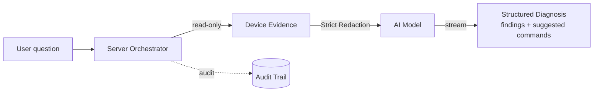

# AI Diagnostics

In addition to manual control, LCXL Remote Desk lets AI models **read and analyze** the device's status to help troubleshoot — in plain language.

## How It Works

When a user asks a question during a session (e.g. *"Why is this system slow?"*), the server orchestrates a strict pipeline:

1. **Collect** read-only evidence (system info, processes, ports, logs, screenshots).
2. **Redact** sensitive data locally — this step **fails closed**.
3. **Call the model** (only after redaction succeeds).
4. **Render** a structured diagnosis: findings + suggested commands.

## Key Properties

- **Read-Only Data Collection** — gathers system info, processes, ports, logs, and screenshots.
- **Model Agnostic** — compatible with both OpenAI-compatible and Anthropic endpoints.
- **Suggest-Only Defaults** — the model proposes fixes; execution requires explicit user confirmation.
- **Flexible Deployment** — diagnostic logic is centralized in the `desk-diagnose-core` crate. Nodes can act as evidence collectors that send redacted data to a central server for inference, enabling secure API-key management for fleet deployments.

## Configuration

Configure the provider, base URL, model, and API key from the management console. **API keys are strictly server-side secrets** — they are never returned to the browser, never written to logs, and never included in any public settings DTO.

## Security

The full set of invariants — server-side authority, fail-closed redaction, server-only keys, and metadata-only audit — is documented in the [AI Security Model](/security/ai-security-model).
