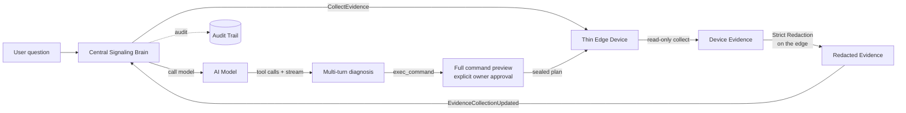

# AI Diagnostics

In addition to manual control, LCXL Remote Desk lets AI models **read and analyze** device state and, when the authenticated owner explicitly approves a command, act on the diagnosis.

::: info Under a shared access code
When you connect by an [access code](/guide/access-codes) rather than as the owner, the session is capability-scoped. It never receives owner free-form command admission; non-owner and shared-access execution remains template-constrained or disabled.
:::

## How It Works

AI is orchestrated by the **central signaling server** (the "central brain"); the device is a **thin edge** that only provides read-only evidence on request. When a user asks a question during a session (e.g. *"Why is this system slow?"*), the central server drives a strict pipeline:

1. The central brain requests **read-only evidence** from the edge (system info, processes, ports, logs, screenshots).
2. The edge **collects and redacts** the evidence locally — redaction **fails closed**, and raw screenshot bytes are stripped before anything leaves the host.
3. The central brain **calls the model** (only after the edge's redaction succeeds).
4. The central brain runs a multi-turn tool loop and streams the answer back to the browser.
5. If the model requests `exec_command`, the loop parks. The browser shows the complete shell, command, working directory, timeout, and server-authoritative risk; only an explicit approval resumes dispatch.

The diagnosis panel has explicit resize handles: drag its left edge to change
the width, its bottom edge to change the height, or its lower-left corner to
change both. Drag the title bar to move the panel anywhere within the remote
desktop view. While the view is at the bottom, streaming output follows the
latest text automatically. Scrolling up pauses that behavior and shows a
down-arrow button that returns to the latest content without losing the
reader's place unexpectedly.

## Key Properties

- **Thin Edge** — the device never runs model inference or holds provider credentials; it only collects and redacts evidence when the central brain asks.
- **Read-Only Data Collection** — system info, processes, ports, logs, and optional screenshots, gated locally by the edge collection policy. A screenshot is offered only to a model declared image-capable; the original image is kept only while the active turn needs it, then replaced by bounded text metadata instead of being retained in conversation history.
- **Model Agnostic** — compatible with both OpenAI-compatible and Anthropic endpoints, configured centrally.
- **Suggest-Only Defaults** — the model proposes fixes; execution requires explicit user confirmation, capped by each device's local execution ceiling.
- **Owner-Confirmed Actions** — in Confirm Each Action / Session Approved mode, the authenticated owner may approve an off-template PowerShell, pwsh, bash, or sh command. It is always shown as **Critical** and only the effective blocklist is claimed to have been checked.
- **Target-Verified Shells** — the Desk Server runs a bounded, side-effect-free probe for the executor-supported interpreters when it connects. The model's `exec_command.shell` schema lists only the verified intersection and marks the first entry as preferred. If a model still requests another shell, it receives `unsupported_exec_shell` with the current available list and may retry without opening an approval.
- **No Autonomous Approval** — the model may request a command, but it cannot approve its own request. Fleet, automation, MCP, shared-access, and non-owner paths remain template-only or non-executable.
- **Bounded, Continuable Turns** — the central loop stops after too many calls to the same tool type. Completed output and tool results remain visible and persisted, so the user can send a follow-up such as “continue” in the same conversation.
- **Durable Background Commands** — an approved command that is still running after **8 seconds** becomes a background task instead of blocking the diagnosis turn. The dispatch receipt returns the task ID to the model as a structured field, while the diagnosis panel shows a localized “Moved to background” state with the same ID so the user, model, and later completion event can correlate it precisely. The command keeps running until it completes, the operator cancels it from the diagnosis panel, or it reaches the device-local **command runtime limit**. That limit is configured under the Desk Server's Local AI Policy, defaults to **600 seconds**, and accepts **10–7200 seconds**; it is independent of the 8-second foreground threshold. Saving a new limit automatically refreshes the host's central signaling registrations, while the host immediately enforces the saved value as its authoritative ceiling. Portable/open-source Signal stores the task and its completion in SQLite, exposes it through `wait_for_task`, replays pending completion delivery after a Signal restart, and asks the host's execution ledger when a live result was missed. Once the durable result arrives, Signal fires one bounded, read-only follow-up turn so the model interprets the result without waiting for another user message; that turn cannot execute a new command. The Manager path provides the same completion-follow-up behavior through its distributed work ledger when the administrator enables automation.
- **Readable Answers** — assistant prose is rendered as GitHub-flavored Markdown, including headings, lists, code, and tables. Raw HTML is ignored and model-supplied image URLs are not loaded.
- **Recoverable Conversation View** — both Manager and Portable/open-source Signal expose the same persisted conversation snapshot. If a terminal live event is missed, the panel recovers the settled answer and tool results instead of remaining stuck on “Awaiting approval”.
- **Inspectable Tool Calls** — select any item in the tool timeline to expand the model-produced JSON input and the redacted, bounded output returned to the model. The details remain available in settled turns and restored conversation history.
- **Shared Core** — the transport-neutral diagnostic logic lives in the `desk-diagnose-core` crate, reused by the central brain so behavior never drifts.

::: tip DeskServer-only mode has no local brain
A headless `desk-server` is a pure thin edge: it has **no embedded signaling server**, so it must be attached to a remote central server (signaling server or manager) to use AI features. The portable `default` mode embeds the signaling server in the same process, so it remains self-contained.
:::

## Configuration

The **model provider** (provider, base URL, model, API key, output format, granted execution mode, per-turn reasoning-round limit, and per-turn same-tool call limit) is configured on the **central signaling server**. The reasoning-round limit defaults to **40**, accepts **1–80**, counts model responses rather than individual tool calls, and cannot be lower than the same-tool limit. The same-tool limit defaults to **20**, accepts **1–50**, and counts calls to one tool type even when its arguments differ. Both are independent of the Desk Server's simultaneous-command-process limit. **API keys are strictly server-side secrets** — they are never returned to the browser, never written to logs, and never included in any public settings DTO.

A **Test connection** button next to Save probes the provider fields currently shown in the form, including unsaved edits, without persisting them. A text-only provider receives a tiny one-word chat probe; when **Supports image input** is enabled, the same button sends the repository-owned visual probe and succeeds only when the model reads its marker. The result reports the validated `text` / `image_input` capabilities. A blank API-key field reuses the stored secret; a newly entered key is used only for the probe until Save is selected. The API key stays server-side throughout.

Each device additionally keeps two **local** controls in its own settings: an **execution ceiling** (the highest mode the AI may use on that device, which caps any central grant) and an **evidence collection policy** (`allow_logs` / `allow_screen`, the device's final say over what evidence may leave it).

## Security

The full set of invariants — server-side authority, fail-closed redaction, server-only keys, and metadata-only audit — is documented in the [AI Security Model](/security/ai-security-model).
