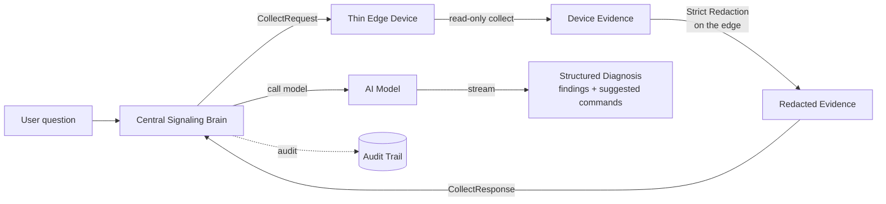

# AI Diagnostics

In addition to manual control, LCXL Remote Desk lets AI models **read and analyze** the device's status to help troubleshoot — in plain language.

## How It Works

AI is orchestrated by the **central signaling server** (the "central brain"); the device is a **thin edge** that only provides read-only evidence on request. When a user asks a question during a session (e.g. *"Why is this system slow?"*), the central server drives a strict pipeline:

1. The central brain requests **read-only evidence** from the edge (system info, processes, ports, logs, screenshots).
2. The edge **collects and redacts** the evidence locally — redaction **fails closed**, and raw screenshot bytes are stripped before anything leaves the host.
3. The central brain **calls the model** (only after the edge's redaction succeeds).
4. The central brain **renders** a structured diagnosis (findings + suggested commands) and streams it back to the browser.

## Key Properties

- **Thin Edge** — the device never runs model inference or holds provider credentials; it only collects and redacts evidence when the central brain asks.
- **Read-Only Data Collection** — system info, processes, ports, logs, and screenshots, gated locally by the edge collection policy.
- **Model Agnostic** — compatible with both OpenAI-compatible and Anthropic endpoints, configured centrally.
- **Suggest-Only Defaults** — the model proposes fixes; execution requires explicit user confirmation, capped by each device's local execution ceiling.
- **Shared Core** — the transport-neutral diagnostic logic lives in the `desk-diagnose-core` crate, reused by the central brain so behavior never drifts.

::: tip DeskServer-only mode has no local brain
A headless `desk-server` is a pure thin edge: it has **no embedded signaling server**, so it must be attached to a remote central server (signaling server or manager) to use AI features. The portable `default` mode embeds the signaling server in the same process, so it remains self-contained.
:::

## Configuration

The **model provider** (provider, base URL, model, API key, output format, and the granted execution mode) is configured on the **central signaling server**. **API keys are strictly server-side secrets** — they are never returned to the browser, never written to logs, and never included in any public settings DTO.

A **Test connection** button next to Save probes the **saved** provider config end-to-end: it sends a tiny chat request (a one-word reply) through the configured base URL / API key / model and reports the latency and a reply snippet, or the real upstream reason on failure. It runs against the stored config, so save your edits before testing. The API key stays server-side throughout.

Each device additionally keeps two **local** controls in its own settings: an **execution ceiling** (the highest mode the AI may use on that device, which caps any central grant) and an **evidence collection policy** (`allow_logs` / `allow_screen`, the device's final say over what evidence may leave it).

## Security

The full set of invariants — server-side authority, fail-closed redaction, server-only keys, and metadata-only audit — is documented in the [AI Security Model](/security/ai-security-model).
