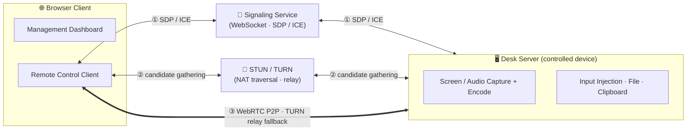

# Core Concepts

A quick mental model of the moving parts.

## Roles

- **Controller (Browser Client)** — the browser that initiates remote control. Also hosts the management dashboard.
- **Desk Server (controlled device)** — captures and encodes the screen/audio, injects input, and serves files, clipboard, and terminal.
- **Signaling Service** — a WebSocket service that exchanges SDP / ICE between controller and desk server. Built into the server.
- **STUN / TURN** — NAT traversal and relay. Also built into the server.

## Connection & Media Path

The browser and remote device exchange SDP / ICE through the signaling service and use STUN/TURN to gather candidate addresses. They prioritize a **direct WebRTC P2P connection** and only fall back to **TURN relays** if NAT traversal fails. Signaling and TURN are built into the server.

Once connected, video, Opus audio, and data channels (for input, clipboard, and file management) run over WebRTC. The remote terminal uses a dedicated data channel.

## Transport Summary

| Channel | Carries |
|---|---|
| Video track | Encoded screen frames (AV1 / H.264 / VP8 / VP9) |
| Audio track | Host-authorized, live Opus system audio |
| Data channel (input) | Mouse / keyboard injection |
| Data channel (clipboard) | Bidirectional text clipboard |
| Data channel (file) | Uploads, downloads, deletions |
| Data channel (terminal) | Dedicated xterm.js shell stream |

## AI as a Control Plane

Beyond the browser, AI models can **read and analyze** device state. The server orchestrates a strict pipeline — **collect → redact → model → render** — for in-client diagnostics. On an owner's own device, the agent may additionally request a command; the host executes it only after the owner confirms the exact full command. The MCP server remains read-only. See [AI Diagnostics](/features/ai-diagnostics) and the [AI Security Model](/security/ai-security-model).

## Next

The default process runs everything in one process, but capturing secure surfaces (Windows UAC / lock screen) requires splitting across privilege boundaries — see [Startup Modes](/guide/startup-modes).
