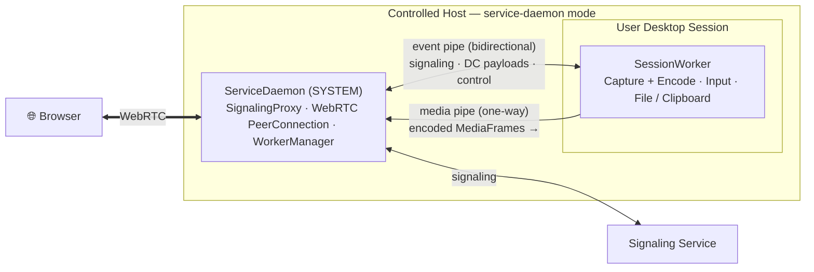

# Startup Modes

The `server` binary supports several startup modes via `--startup-mode` (or `-s`). The configuration file path can be set with `-c`.

```bash
cargo run -- --startup-mode <MODE>
cargo run -- --help
```

## Available Modes

| Mode | Role |
|---|---|
| `default` | Full mode — runs Signaling + Desk Server + WebRTC + Capture in a single process. |
| `signaling` | Signaling service only (Signaling + TURN). |
| `desk-server` | Desk server only (controlled device). |
| `service-daemon` | System service daemon (SYSTEM / root) that manages per-session workers. |
| `session-worker` | Worker process launched by the daemon inside the user's desktop session. |
| `mcp-stdio` | Read-only MCP server over stdio for local AI assistants. |

## Default Mode

The simplest layout: WebRTC, capturing, and input injection all run in one process. Ideal for portable use and development.

## Service-Daemon Process Model

To capture secure environments like the Windows **UAC** or **lock screen**, the service-daemon mode splits operations across privilege boundaries:



The **ServiceDaemon** (running as SYSTEM) owns the WebRTC connection, signaling, and child processes. It spawns a **SessionWorker** inside each desktop session to handle screen capture and input injection. They communicate via a bidirectional **event pipe** (signaling and control) and a one-way **media pipe** (encoded frames).

This split lets session workers restart during user switching **without dropping the browser connection** — the peer connection lives in the daemon.

## MCP stdio Mode

`--startup-mode mcp-stdio` turns the device into a [read-only MCP server](/features/mcp-server). In this mode stdin/stdout carry MCP JSON-RPC, so the server must never log to stdout.
