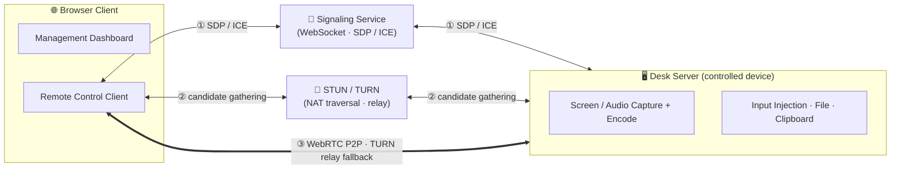
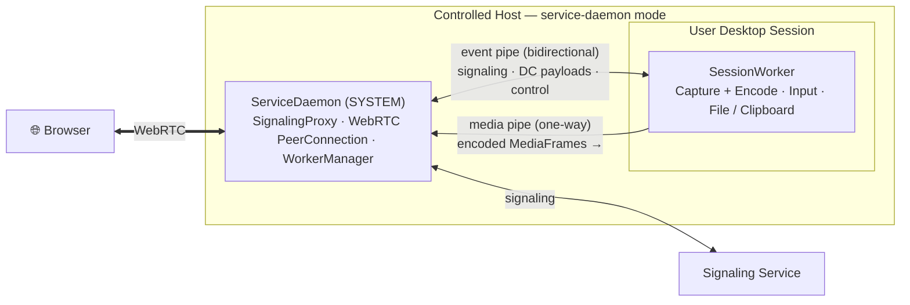
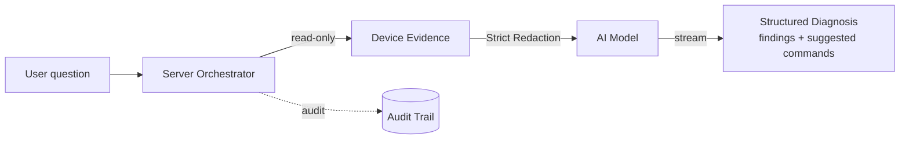

# Architecture

A developer-oriented overview of how LCXL Remote Desk is put together. For a gentler introduction, see [Core Concepts](/guide/concepts).

## Connection & Media Path

The browser and remote device exchange SDP / ICE through the signaling service and use STUN/TURN to gather candidates. They prioritize a direct WebRTC P2P connection and fall back to TURN relay only when NAT traversal fails. Signaling and TURN are built into the server.

## Process Model (service-daemon)

The ServiceDaemon (SYSTEM) owns the WebRTC connection, signaling, and child processes; it spawns a SessionWorker per desktop session for capture and input. The peer connection lives in the daemon, so workers can restart during user switching without dropping the browser connection.

## AI Diagnostic Pipeline

The orchestrator runs **collect → redact → model → render**, failing closed on redaction. See the [AI Security Model](/security/ai-security-model).

## Tech Stack

**Backend** — Rust (Edition 2024, 1.90+), Actix-Web 4.11, webrtc-rs 0.17, Actix-Session, Utoipa 5 (OpenAPI), turn 0.17, Prometheus.

**Frontend** — React 19, TailwindCSS + Shadcn UI (Radix), Vite 7, Kubb (OpenAPI → React Query / TS), TypeScript 5.9, xterm.js 5.5, TanStack Query v5.

**Multimedia** — capture via DXGI / WGC (Windows), X11 / Wayland + PipeWire (Linux); encode via X264 / OpenH264 / VP8 / VP9 / AV1; audio via WASAPI / ALSA / PipeWire + Opus.

See the [Module Map](/reference/modules) for crate-level detail.
