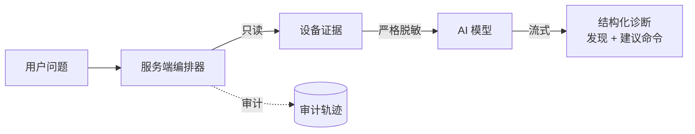

# AI 诊断

除了手动控制，LCXL Remote Desk 还让 AI 模型**读取并分析**设备状态来辅助排障——以自然语言进行。

## 工作原理

当用户在会话中提问（如*“这个系统为什么这么慢？”*），服务端编排一条严格流水线：

1. **采集**只读证据（系统信息、进程、端口、日志、截图）。
2. 本地**脱敏**敏感数据——此步 **fail-closed**。
3. **调用模型**（仅在脱敏成功后）。
4. **渲染**结构化诊断：发现 + 建议命令。

## 关键特性

- **只读数据采集**——采集系统信息、进程、端口、日志与截图。
- **模型无关**——兼容 OpenAI 兼容端点与 Anthropic 端点。
- **默认只给建议**——模型提出修复建议，执行需用户显式确认。
- **灵活部署**——诊断逻辑集中在 `desk-diagnose-core` crate。节点可作为证据采集器，把脱敏后的数据发往中心服务器推理，从而在车队部署中实现安全的 API Key 管理。

## 配置

从管理控制台配置供应商、base URL、模型与 API Key。**API Key 是严格的服务端密钥**——绝不回传浏览器、绝不写日志、绝不进任何公开设置 DTO。

## 安全

完整的不变量集合——服务端权威、fail-closed 脱敏、密钥仅存服务端、审计只记元数据——记录于 [AI 安全模型](/zh/security/ai-security-model)。
