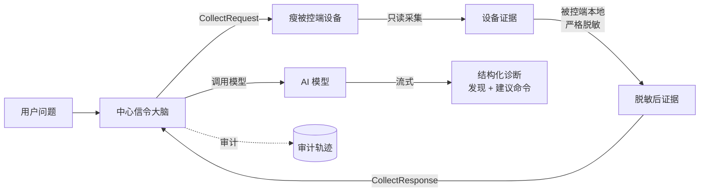

# AI 诊断

除了手动控制，LCXL Remote Desk 还让 AI 模型**读取并分析**设备状态来辅助排障——以自然语言进行。

## 工作原理

AI 由**中心信令服务器**（“中心大脑”）编排；设备只是一个**瘦被控端**，仅在收到请求时提供只读证据。当用户在会话中提问（如*“这个系统为什么这么慢？”*），中心服务器驱动一条严格流水线：

1. 中心大脑向被控端请求**只读证据**（系统信息、进程、端口、日志、截图）。
2. 被控端本地**采集并脱敏**证据——脱敏 **fail-closed**，且原始截图字节在离开主机前被剥离。
3. 中心大脑**调用模型**（仅在被控端脱敏成功后）。
4. 中心大脑**渲染**结构化诊断（发现 + 建议命令）并流式回传浏览器。

## 关键特性

- **瘦被控端**——设备从不运行模型推理、也不持有供应商凭据；只在中心大脑请求时采集并脱敏证据。
- **只读数据采集**——系统信息、进程、端口、日志与截图，由被控端采集策略本地把关。
- **模型无关**——兼容 OpenAI 兼容端点与 Anthropic 端点，在中心统一配置。
- **默认只给建议**——模型提出修复建议，执行需用户显式确认，并受每台设备本地执行上限约束。
- **共享内核**——传输中立的诊断逻辑集中在 `desk-diagnose-core` crate，由中心大脑复用，杜绝行为漂移。

::: tip DeskServer-only 模式没有本地大脑
无头 `desk-server` 是纯瘦被控端：它**不内嵌信令服务器**，因此必须连接一个远端中心服务器（信令服务器或 manager）才能使用 AI 功能。便携 `default` 模式把信令服务器内嵌在同一进程，故仍然自包含。
:::

## 配置

**模型提供方**（供应商、base URL、模型、API Key、输出格式以及授予的执行模式）在**中心信令服务器**上配置。**API Key 是严格的服务端密钥**——绝不回传浏览器、绝不写日志、绝不进任何公开设置 DTO。

保存按钮旁的**「测试连接」**按钮会对**已保存**的提供方配置做端到端探测：用配置的 base URL / API Key / 模型发一次极小对话请求（回一个词），返回延迟与回复片段，失败时透传上游真实原因。它测的是**已保存**的配置，因此改动后请先保存再测试。API Key 全程留在服务端。

每台设备另在自己的设置里保留两项**本地**控制：**执行上限**（AI 在该设备上可用的最高模式，用于收紧中心授权）与**证据采集策略**（`allow_logs` / `allow_screen`，设备对“哪些证据可以离开本机”的最终决定权）。

## 安全

完整的不变量集合——服务端权威、fail-closed 脱敏、密钥仅存服务端、审计只记元数据——记录于 [AI 安全模型](/zh/security/ai-security-model)。
