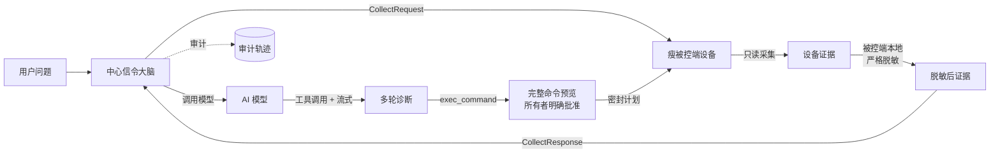

# AI 诊断

除了手动控制，LCXL Remote Desk 还让 AI 模型**读取并分析**设备状态，并在经过认证的设备所有者明确批准命令后对诊断采取行动。

::: info 通过访问码连接时
通过[访问码](/zh/guide/access-codes)连接时，会话会受到权限限制。只有设备所有者直接登录自己的设备时，才能逐条确认自由命令；其他用户和共享访问会话仍然只能使用命令模板，或保持禁止执行。
:::

## 工作原理

AI 由**中心信令服务器**（“中心大脑”）编排；设备只是一个**瘦被控端**，仅在收到请求时提供只读证据。当用户在会话中提问（如*“这个系统为什么这么慢？”*），中心服务器驱动一条严格流水线：

1. 中心大脑向被控端请求**只读证据**（系统信息、进程、端口、日志、截图）。
2. 被控端在本地**采集并脱敏**证据；脱敏失败会立即中止，原始截图数据也会在离开设备前移除。
3. 中心大脑**调用模型**（仅在被控端脱敏成功后）。
4. 中心大脑运行多轮工具循环，并把回答流式回传浏览器。
5. 如果模型请求执行命令，诊断流程会暂停等待确认；浏览器会完整展示命令解释器、命令内容、工作目录、超时时间和服务端判定的风险等级，用户明确批准后才会下发。

## 关键特性

- **瘦被控端**——设备从不运行模型推理、也不持有供应商凭据；只在中心大脑请求时采集并脱敏证据。
- **只读数据采集**——系统信息、进程、端口、日志与截图，由被控端采集策略本地把关。
- **模型无关**——兼容 OpenAI 兼容端点与 Anthropic 端点，在中心统一配置。
- **默认只给建议**——模型可以提出修复建议；真正执行必须由用户明确确认，并受每台设备的本地执行上限约束。
- **所有者确认后执行**——在「逐项确认」/「会话已批准」模式下，经认证的所有者可批准非模板 PowerShell、pwsh、bash 或 sh 命令。此类命令一律显示为**严重风险**，界面只声明检查了有效黑名单。
- **按目标设备检测命令解释器**——Desk 服务建立连接时，会以有界且无副作用的方式检测可用的命令解释器。模型只能从检测结果与执行器白名单的交集中选择，并优先使用推荐项。如果模型请求了其他解释器，服务端会返回当前可用列表，模型可以改用其中一个选项重试。
- **不能自行批准**——模型可以请求命令，但不能批准自己的请求。批量运维、自动化、MCP、共享访问和非所有者操作仍然只能使用模板，或保持禁止执行。
- **回合有界且可继续**——中心循环在同一类工具调用过多时停止；已经生成的输出和工具结果仍会展示并持久化，用户可在同一会话中发送“继续”等后续问题。
- **后台命令可持续跟踪**——批准后的命令运行超过 **8 秒**时会转为后台任务，不再占用当前诊断回合。诊断面板会显示任务编号，方便用户、模型和后续完成事件相互对应。命令会持续运行，直到正常完成、用户取消，或达到设备设置的单条命令执行时间上限。

  便携模式和开源信令服务会把任务及其完成结果保存在 SQLite 中。信令服务重启后仍能补发尚未送达的结果；实时结果丢失时，也可从被控端的执行记录恢复。任务完成后，系统会自动发起一次有界的只读跟进，让模型解释结果，但不会在无人确认的情况下执行新命令。管理员开启自动化后，Manager 也提供相同能力。
- **易读回答**——助手正文按 GitHub 风格 Markdown 渲染，支持标题、列表、代码和表格；原始 HTML 会被忽略，也不会加载模型提供的图片 URL。
- **对话可以恢复**——Manager、便携模式和开源信令服务都会保存会话快照。即使前端漏掉最终状态的实时通知，也能恢复已经结束的回答和工具结果，不会一直停留在“等待确认”。
- **工具调用可检查**——点击工具时间线中的任意一项，可以展开查看模型生成的 JSON 输入，以及返回给模型的脱敏、限长输出；已结束的回合和恢复后的历史会话同样保留这些详情。
- **共享内核**——传输中立的诊断逻辑集中在 `desk-diagnose-core` crate，由中心大脑复用，杜绝行为漂移。

::: tip 仅被控端模式需要远端中心服务
无界面的 `desk-server` 是纯被控端，不内嵌信令服务器，因此必须连接远端信令服务或 Manager 才能使用 AI 功能。便携 `default` 模式在同一进程内包含信令服务，可以独立使用。
:::

## 配置

**模型提供方**（供应商、base URL、模型、API Key、输出格式、授予的执行模式、单回合推理轮次上限以及单回合同一工具调用上限）在**中心信令服务器**上配置。推理轮次上限默认 **40**、取值范围 **1–80**，统计的是模型响应轮次而不是单个工具调用，并且不得小于同一工具调用上限。同一工具调用上限默认 **20**、取值范围 **1–50**；即使参数不同，只要工具类型相同也计入。两者都与 Desk 服务端的同时运行命令进程数相互独立。**API Key 是严格的服务端密钥**——绝不回传浏览器、绝不写日志、绝不进任何公开设置 DTO。

保存按钮旁的**「测试连接」**按钮会对**已保存**的提供方配置做端到端探测：用配置的 base URL / API Key / 模型发一次极小对话请求（回一个词），返回延迟与回复片段，失败时透传上游真实原因。它测的是**已保存**的配置，因此改动后请先保存再测试。API Key 全程留在服务端。

每台设备另在自己的设置里保留两项**本地**控制：**执行上限**（AI 在该设备上可用的最高模式，用于收紧中心授权）与**证据采集策略**（`allow_logs` / `allow_screen`，设备对“哪些证据可以离开本机”的最终决定权）。

## 安全

服务端统一判断权限、脱敏失败即中止、密钥仅存服务端、审计不记录原文等安全规则，详见 [AI 安全模型](/zh/security/ai-security-model)。
