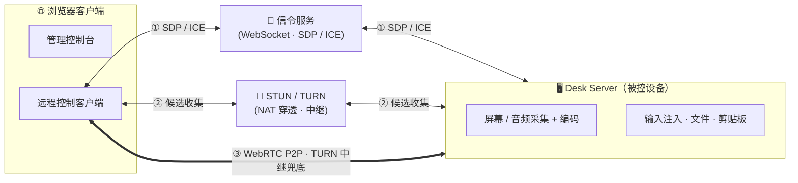

# 核心概念

快速建立对各组成部分的心智模型。

## 角色

- **控制端（浏览器客户端）**——发起远程控制的浏览器，同时承载管理控制台。
- **被控端 Desk Server**——采集并编码屏幕/音频、注入输入，提供文件、剪贴板与终端。
- **信令服务**——通过 WebSocket 在控制端与被控端之间交换 SDP / ICE，内置于 server。
- **STUN / TURN**——NAT 穿透与中继，同样内置于 server。

## 连接与媒体路径

浏览器与远端设备通过信令服务交换 SDP / ICE，并用 STUN/TURN 收集候选地址。它们优先**直连 WebRTC P2P**，仅当 NAT 穿透失败时才回退到 **TURN 中继**。信令与 TURN 内置于 server。

连接建立后，视频、Opus 音频及数据通道（输入、剪贴板、文件管理）都跑在 WebRTC 上。远程终端使用专用数据通道。

## 传输一览

| 通道 | 承载 |
|---|---|
| 视频轨 | 编码后的屏幕帧（AV1 / H.264 / VP8 / VP9） |
| 音频轨 | Opus 编码的系统音频 |
| 数据通道（输入） | 鼠标 / 键盘注入 |
| 数据通道（剪贴板） | 双向文本剪贴板 |
| 数据通道（文件） | 上传、下载、删除 |
| 数据通道（终端） | 专用的 xterm.js shell 流 |

## AI 作为控制端

除了浏览器，AI 模型还能**读取并分析**设备状态。服务端为会话内诊断编排一条严格流水线——**采集 → 脱敏 → 模型 → 渲染**。在 owner 自己的设备上，Agent 还可请求命令，但被控端只会在 owner 确认完整命令后执行；MCP 服务仍保持只读。见 [AI 诊断](/zh/features/ai-diagnostics)与 [AI 安全模型](/zh/security/ai-security-model)。

## 下一步

默认进程把所有功能跑在一个进程里，但采集安全界面（Windows UAC / 锁屏）需要跨权限边界拆分——见[启动模式](/zh/guide/startup-modes)。
