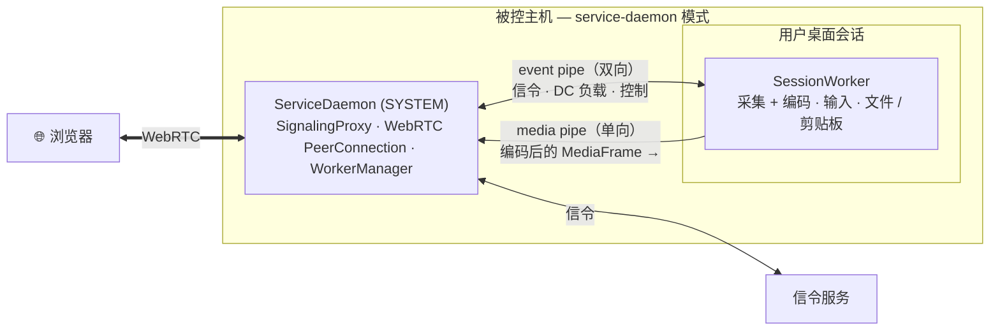

# 启动模式

`server` 二进制通过 `--startup-mode`（或 `-s`）支持多种启动模式。配置文件路径用 `-c` 指定。

```bash
cargo run -- --startup-mode <MODE>
cargo run -- --help
```

## 可用模式

| 模式 | 角色 |
|---|---|
| `default` | 完整模式——在单进程中运行 信令 + Desk Server + WebRTC + 采集。 |
| `signaling` | 仅信令服务（信令 + TURN）。 |
| `desk-server` | 仅被控端（Desk Server）。 |
| `service-daemon` | 系统服务守护进程（SYSTEM / root），管理各会话的 worker。 |
| `session-worker` | 由守护进程在用户桌面会话中启动的内部工作进程。 |
| `mcp-stdio` | 面向本地 AI 助手的只读 MCP 服务（stdio）。 |

## 默认模式

最简布局：WebRTC、采集与输入注入都在一个进程里。适合便携使用与开发。

## service-daemon 进程模型

为了采集 Windows **UAC** 或**锁屏**等安全界面，service-daemon 模式将操作跨权限边界拆分：



**ServiceDaemon**（以 SYSTEM 运行）持有 WebRTC 连接、信令与子进程；它在每个桌面会话中启动一个 **SessionWorker** 处理屏幕采集与输入注入。二者通过双向 **event pipe**（信令与控制）与单向 **media pipe**（编码帧）通信。

这种拆分让会话工作进程可以在用户切换时重启，而**不中断浏览器连接**，因为 WebRTC 对等连接由守护进程持有。

## MCP stdio 模式

`--startup-mode mcp-stdio` 把设备变成一个[只读 MCP 服务](/zh/features/mcp-server)。该模式下 stdin/stdout 承载 MCP JSON-RPC，因此服务端**绝不能向 stdout 打日志**。
