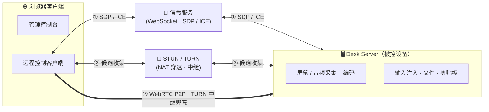
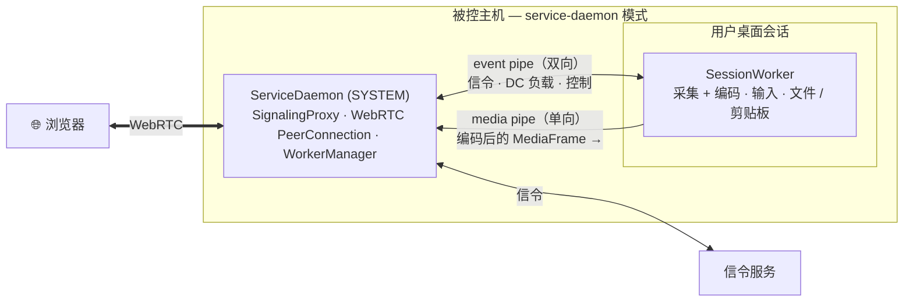
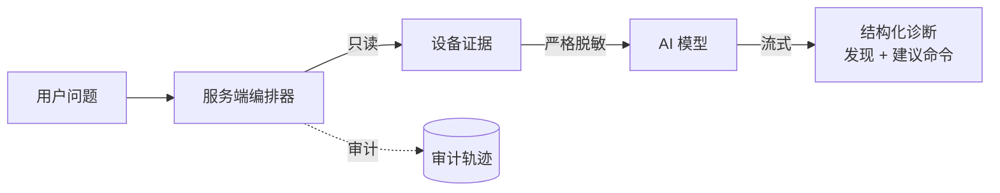

# 架构

面向开发者的整体概览。更轻量的入门见[核心概念](/zh/guide/concepts)。

## 连接与媒体路径

浏览器与远端设备通过信令服务交换 SDP / ICE，并用 STUN/TURN 收集候选。它们优先直连 WebRTC P2P，仅当 NAT 穿透失败时回退到 TURN 中继。信令与 TURN 内置于 server。

## 进程模型（service-daemon）

ServiceDaemon（SYSTEM）持有 WebRTC 连接、信令与子进程；它为每个桌面会话启动一个 SessionWorker 做采集与输入。对等连接位于守护进程，因此 worker 能在用户切换时重启而不中断浏览器连接。

## AI 诊断流水线

编排器按照 **采集 → 脱敏 → 模型 → 展示** 的顺序运行；任何脱敏失败都会立即中止请求。见 [AI 安全模型](/zh/security/ai-security-model)。

## 技术栈

**后端**——Rust（Edition 2024，1.90+）、Actix-Web 4.11、webrtc-rs 0.17、Actix-Session、Utoipa 5（OpenAPI）、turn 0.17、Prometheus。

**前端**——React 19、TailwindCSS + Shadcn UI（Radix）、Vite 7、Kubb（OpenAPI → React Query / TS）、TypeScript 5.9、xterm.js 5.5、TanStack Query v5。

**多媒体**——采集经 DXGI / WGC（Windows）、X11 / Wayland + PipeWire（Linux）；编码经 X264 / OpenH264 / VP8 / VP9 / AV1；音频经 WASAPI / ALSA / PipeWire + Opus。

crate 级别细节见[模块地图](/zh/reference/modules)。
